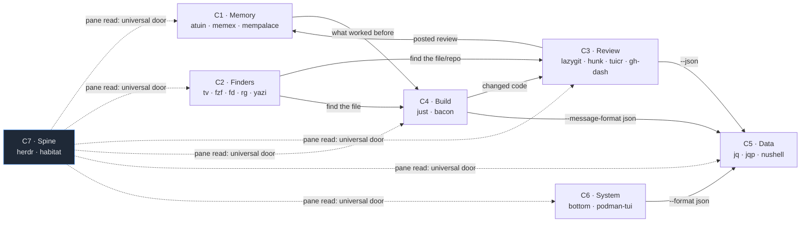

# Tool Clusters — the seven functional groups

**Navigation:** [[40 Reference/Command Matrix#Composition and verification routes|Command Matrix ⇄ composition routes]] · [[00 - Toolshed Index|Toolshed master index]]. Resolve C1–C7 into the memory, finder, review, build, data, system and spine groups.

Sixteen tools is too many to hold in mind as a list. As **clusters** it is seven ideas. Each cluster has an *entry point* (where you start), a *spine* (the tool doing the work), and an *exit* (what it hands to the next cluster).

---

## C1 · Memory — three layers of recall 🧠

Service interfaces: [[40 Reference/Command Matrix#Service command doors|return to the Command Matrix]].

| Layer | Tool | Answers |
|---|---|---|
| Shell | [[atuin]] | *what did I **type**?* — with cwd, exit code, duration |
| Session | memex (plugin, `ctrl+b m`) | *what did we **discuss**?* — agent transcripts |
| Knowledge | [[mempalace]] | *what do I **know**?* — semantic, over three vaults |

**The signature chain:** `atuin → mempalace` (the habitat's most frequent adjacency). A memory question almost always has both halves.

```bash
atuin search --cmd-only --exit 0 podman     # the command
mempalace search "why is podman.socket disabled"   # the reason
```

> memex has no CLI — it is plugin-only, so it joins the cluster through the keybinding, not the pipeline. **mempalace is the only member with an unwired MCP server**, and the most-used tool in the habitat; wiring it is the single highest-leverage move available.

---

## C2 · Finders — locate anything 🔎

Service interfaces: [[40 Reference/Command Matrix#Service command doors|return to the Command Matrix]].

**Entry:** [[television]] (the hub — appears in more adjacency pairs than any other tool) · **Primitives:** [[fzf]], `fd`, `rg` · **Visual:** [[yazi]]

```
tv (10 channels) ──┬─ files/dirs/text ──→ nvim
                   ├─ git-repos/branch/log/diff ──→ lazygit
                   ├─ bash-history ──→ (atuin does this better, with filters)
                   └─ docker-images ──→ podman
yazi ─ s/S keys delegate to ─→ fd / rg   (the same engines I call directly)
fzf ─ the ranking function INSIDE any of the above
```

**Investment thesis:** tv's custom channels (TOML in `~/.config/television/cable/`) can wrap *any* line-emitting command with a preview. A `herdr-panes` channel and an `obsidian-notes` channel would make tv a habitat-wide teleporter. Highest-value unbuilt integration after the mempalace MCP.

---

## C3 · Review — judging change ⚖️

Service interfaces: [[40 Reference/Command Matrix#Service command doors|return to the Command Matrix]].

| Tool | Role | Direction |
|---|---|---|
| [[lazygit]] | **operate** the repo | human |
| [[hunk]] | live shared diff session | **↔ bidirectional** (daemon) |
| [[tuicr]] | persisted review, forge submit | **↔ bidirectional** (CLI/TUI split) |
| reviewr (plugin) | comments → agent input | human → agent |
| [[gh-dash]] | PR radar | human → hands me a number |

**Flow:** `lazygit` (stage/commit) → `hunk` (review what changed) → `tuicr :submit` or `gh pr create` → `gh-dash` (watch it land).

`lazygit → hunk` is a live adjacency in the history, and lazygit's **custom commands** can bind it to one key — turning the habitat's most common git sequence into a keystroke.

---

## C4 · Build & verify — is it correct? 🔨

Service interfaces: [[40 Reference/Command Matrix#Service command doors|return to the Command Matrix]].

**Entry:** [[just]] (*what can I do here?*) · **Spine:** [[bacon]] (continuous) · **Exit:** [[hunk]]/[[tuicr]] (review), `gh run` (CI)

```bash
just --summary                 # orient
bacon                          # resident watcher: I edit, it judges
habitat pane bacon             # read the verdict, zero cost
just gate-release              # the project's own quality gate
gh run view <id> --log-failed  # when CI disagrees
```

`bacon --listen` / `--send` (unexplored) would let the resident watcher be *steered* — switch it to clippy without touching the pane.

---

## C5 · Data shaping — reshape anything 🧮

Service interfaces: [[40 Reference/Command Matrix#Service command doors|return to the Command Matrix]].

[[jqp]]/jq (stream surgery) + [[nushell]] (tables, joins, 428 commands) + `jqp` (author queries interactively).

Everything upstream of this cluster emits JSON: `herdr` (NDJSON), `gh --json`, `podman --format json`, `just --dump`, `cargo --message-format json`, `hunk session --json`. **This cluster is the universal adapter** — it is what makes P2 in [[Tool Chaining Patterns]] work at all.

Rule: jq for deep nested reshaping, nu for tabular filtering and joining across sources; `nu -c '… | to json'` bridges back.

---

## C6 · System & containers 🖥️

Service interfaces: [[40 Reference/Command Matrix#Service command doors|return to the Command Matrix]].

[[bottom]] (vitals, display-only) + [[podman-tui]] (containers) + host systemd via `flatpak-spawn --host`.

The Kinoite constraint defines this cluster: **podman is host-side, the toolbox has no `podman` binary**, and the user socket ships disabled. Everything here escapes the container (P6).

---

## C7 · The spine 🕸️

Service interfaces: [[40 Reference/Command Matrix#Service command doors|return to the Command Matrix]].

[[herdr]] + `habitat` + `local.habitat-services`.

Not a peer cluster — the **medium** the other six run in. Its unique contribution: `herdr pane read` makes every tool in every cluster agent-reachable *even when it has no CLI at all*. That is the fact the whole two-door model rests on.

---

## The cluster map



## Where the clusters are thin

- **C1** — mempalace MCP unwired; memex has no CLI at all.
- **C2** — no custom tv channels yet; `yazi`'s `y` cd-wrapper not installed.
- **C4** — `bacon --listen` unexplored; no cross-repo `just` runner.
- **C5** — strongest cluster, nothing missing.
- **C7** — `herdr layout export/apply` unused (declarative layouts as dotfiles).

Related: [[Tool Chaining Patterns]] · [[Workflow Recipes]] · [[Most-Used Tools]]

## Context preparation across clusters — 2026-09-09

[[70 Toolkit/skills#Habitat Context|Habitat Context]] ⇄ this note. Prepare focused context across the existing tool groups using owner, type and topic filters, parallel capture and reusable snapshots. This supplies a reading set for a task; it does not activate a cluster or change its runtime wiring.
