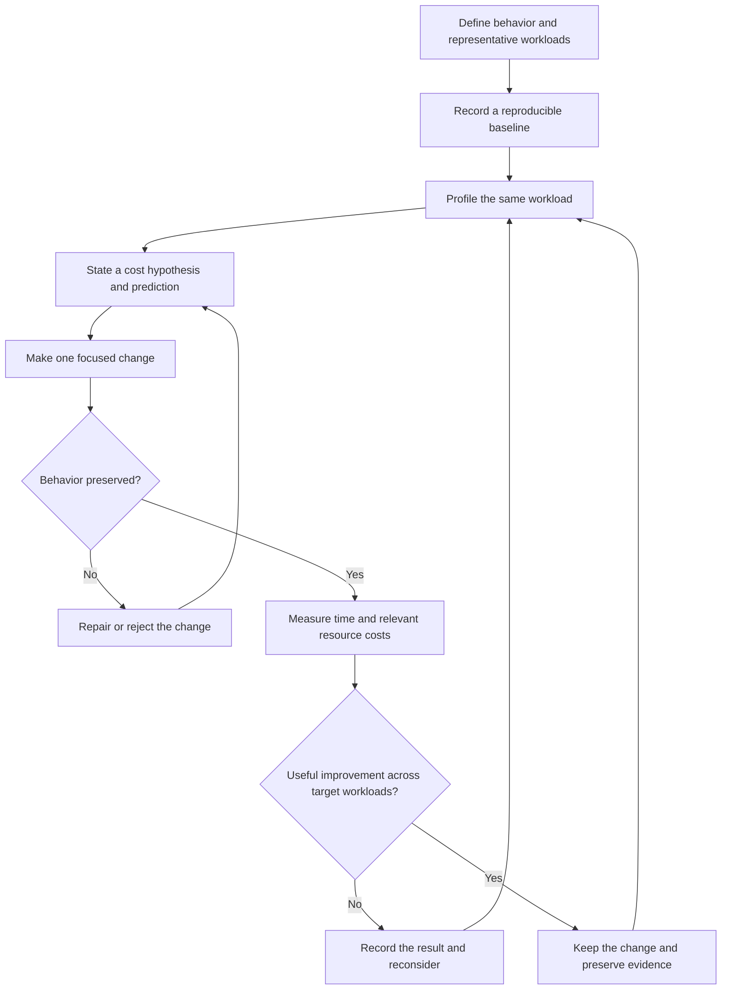

# Perfecting Rust — performance engineering and a route to mastery

Rust mastery means being able to explain a program's ownership, correctness, resource costs, and operational behavior—and to test those explanations. This note develops that practice through **benchmarking → profiling → ownership and allocation changes → verification**, then connects it to the broader Rust learning ecosystem.

The central corpus is Nicholas Nethercote and contributors' [Rust Performance Book](https://nnethercote.github.io/perf-book/). All 19 substantive chapters were reviewed from the pinned source revision above, with deeper examination of benchmarking, profiling, heap allocations, and three linked implementation commits. The additional resource map is a curated reading route, including 14 inspected local book files and selected deeper reading from Effective Rust. Those entire books and repositories have not all been studied here.

**Start here:** [[#Connected notes and master indexes|Connected notes]] · [[#The engineering loop]] · [[#Benchmark the question you actually care about]] · [[#Profile to explain the cost]] · [[#Understand ownership and heap costs]] · [[#A verified allocation laboratory]] · [[#The whole Performance Book as a decision map]] · [[#The wider Rust library]] · [[#Your local Rust bookshelf]] · [[#Builders worth studying]] · [[#Practice until the reasoning is reproducible]]

**Corpus notes:** [[40 Reference/rust-mastery/README|Folder index]] · [[40 Reference/rust-mastery/2026-09-06/Source and Reading Map|Source and Reading Map]] · [[40 Reference/rust-mastery/2026-09-06/Learning Status and Next Steps|Learning Status and Next Steps]].

**Local evidence:** [[40 Reference/rust-mastery/2026-09-06/README|Source ledger, runnable lab, checks, and raw heap profiles]]. Related: [[00 - Toolshed Index]] · [[60 Workflows/Habitat Introspection|Habitat Introspection]].

## Connected notes and master indexes

Each companion below contains a return link to this corpus. Follow the link matching the current task.

- [[40 Reference/Command Matrix#Composition and verification routes|Command Matrix]] — select service interfaces, composition routes and the six Fedora master indexes.
- [[10 Tools/bacon#Rust performance practice|bacon]] — Connect the edit/check loop to semantic tests and measured performance experiments.
- [[10 Tools/just#Rust performance practice|just]] — Turn the experiment contract into discoverable, repeatable project recipes.
- [[10 Tools/bottom#Rust performance practice|bottom]] — Connect system resource observations to CPU profiles and tracked-heap measurements.
- [[10 Tools/podman#Rust performance practice|podman]] — Record container, compiler, resource-limit and output-directory boundaries for experiments.
- [[60 Workflows/Habitat Introspection#Rust performance practice|Habitat Introspection]] — Carry semantic equivalence and dated before/after evidence into Rust optimization.
- [[60 Workflows/00 - Workflows#Rust performance practice|Workflows index]] — Place Rust practice within the daily edit, verify, measure and handoff cycle.

**Evidence and navigation:** [[40 Reference/rust-mastery/2026-09-06/README|Lab and source evidence]] · [[00 - Toolshed Index#Rust mastery|Toolshed master index]] · [Habitat master index](obsidian://open?vault=herdr-fedora-habitat.vault&file=00%20-%20Fedora%20Master%20Index) · [Kinoite master index](obsidian://open?vault=fedora-kinoite.vault&file=00%20-%20Fedora%20Master%20Index). Both Fedora master indexes link back to this note and its evidence pack.

## The engineering loop

The book's reusable lesson is to make performance work empirical: identify important workloads, locate expensive work, change a plausible cause, and measure again. Algorithms and data structures frequently offer more than instruction-level tuning; removing unnecessary calls can outperform making each call slightly cheaper. Optimize complexity where the workload justifies it. [General Tips](https://nnethercote.github.io/perf-book/general-tips.html)



Use three kinds of evidence together:

| Evidence | The question it answers | Its limit |
|---|---|---|
| Correctness checks | Does the candidate preserve the required behavior? | Passing examples do not prove every possible input |
| Benchmarks | How did the measured outcome change? | A narrow workload can misrepresent actual use |
| Profiles and counters | Where does execution or allocation cost accumulate? | Attribution alone does not establish the benefit of a proposed change |

**Synthesis:** a convincing optimization has a causal story. “We stopped owning transient input on duplicate records; allocations fell on duplicate-heavy input; output stayed equal; ordinary execution became faster” is stronger than “the new version got a better number.” If the predicted metric does not move, investigate the explanation even when elapsed time improves.

For a sequential execution, Amdahl's law gives a useful ceiling:

$$S = \frac{1}{(1-f)+f/s}$$

Here, `f` is the original fraction of elapsed time affected and `s` the speedup of that part. If it occupied 30% and becomes twice as fast, overall speedup is approximately 1.176×: elapsed time falls 15%. Eliminating the part entirely caps speedup at about 1.429×. This is a model assuming the remaining work is unchanged. CPU sample share is not automatically elapsed-time share in a concurrent service.

The existing [[60 Workflows/Habitat Introspection|Habitat Introspection]] note provides a local historical parallel: matching the intended database count mattered before replacing an expensive command. Its recorded timings are history, not a benchmark of today's Rust programs.

## Benchmark the question you actually care about

Connect the workload contract to [[#Profile to explain the cost|profiling]]; use the profile to choose the next cost hypothesis.

### Write an experiment contract

Before changing code, specify:

1. **Behavior:** outputs, ordering, errors, accepted encodings, overflow handling, and side effects that must remain equivalent.
2. **Workload:** input provenance and hash; size distribution; duplicate rate; common and rare cases; concurrency; cold or warm state.
3. **Primary outcome:** latency, throughput, completion time, peak memory, binary size, or build time.
4. **Constraints:** acceptable changes in other outcomes and implementation complexity.
5. **Environment:** source revision, lockfile, compiler, target, features, build flags, allocator, OS, CPU, and execution boundary.

Real inputs should anchor the suite. Microbenchmarks help isolate mechanisms, and stress inputs expose limits, but both need a clear relationship to usage. Instruction counts can supplement noisy timing; neither cycles nor instruction counts are guaranteed stable across hardware, compiler versions, and program behavior. [Benchmarking](https://nnethercote.github.io/perf-book/benchmarking.html)

| Outcome | Useful measurement | Common misinterpretation |
|---|---|---|
| Batch/CLI completion | Repeated process elapsed time | Timing `cargo run` also includes Cargo's work |
| Function cost | Time/op and bytes or items/sec | A function returning the wrong result can look excellent |
| Service response | Latency distribution under a stated load, throughput, errors | Average latency hides slow requests; workload generation can hide overload |
| Allocation pressure | Allocations and allocated bytes per operation | Cumulative bytes are not peak memory |
| Footprint | Peak tracked heap plus an appropriate OS memory metric | RSS includes much more than live Rust allocations |
| Developer feedback | Clean build, incremental edit/build, tests | A no-op build says little about changing a hot crate |

### Process benchmarks

Build and preserve both binaries first. The following is a **recipe**, with paths to replace; these Hyperfine commands were not run during this study:

```bash
hyperfine --warmup 3 --runs 20 --export-json timing.json \
  '/path/to/baseline input.txt' \
  '/path/to/candidate input.txt'
```

Hyperfine supports warmups, preparation hooks, repeated runs, and structured exports. Warmup runs define a warm-state experiment. For very short commands, `--shell=none` removes the intermediary shell, but then shell redirection and expansion are unavailable. Keep input/output destinations equivalent. [Hyperfine documentation](https://github.com/sharkdp/hyperfine)

**Experimental practice:** repeat comparisons with reversed or randomized order to investigate thermal or background-load drift. Record raw samples and absolute differences. A 2% change inside comparable run-to-run variation is unresolved. Preserve per-workload results before aggregating them; weighting is a product decision. Do not average percentage changes blindly.

Specify whether results include startup, reading, parsing, formatting, writing, flushing, and destruction. Each choice answers a different question. A benchmark against an in-memory byte slice does not measure filesystem performance.

### Function benchmarks and timing boundaries

The attached laboratory pins **Criterion 0.8.2** and declares `harness = false` for its benchmark. Its eight cases cover two input sizes, two duplicate distributions, and two implementations. The complete benchmark is in the evidence pack. [Criterion API](https://docs.rs/criterion/0.8.2/criterion/)

Its timed operation follows this pattern:

```rust
b.iter(|| {
    black_box(count_reused(Cursor::new(black_box(input.as_bytes()))).unwrap())
})
```

Input generation and complete-result equality checks occur outside the timed closure. Each iteration creates a new result map. Criterion's `iter` includes the destruction of returned values, which fits this experiment's create/use/discard boundary. Use `iter_batched` or `iter_batched_ref` when destructive operations need fresh setup that should be excluded; document what is excluded, including destruction. Repeatedly sorting an already sorted buffer measures a changed workload. [Criterion timing loops](https://bheisler.github.io/criterion.rs/book/user_guide/timing_loops.html)

Use `std::hint::black_box` on runtime-like inputs and observable outputs to discourage unrealistic constant folding and dead-code elimination. It is a best-effort optimization barrier. Wrapping `black_box(5 * 10)` still allows the expression to become `50`; wrapping the operands changes what the compiler can assume. It neither proves benchmark validity nor provides constant-time security guarantees. [Standard-library contract](https://doc.rust-lang.org/std/hint/fn.black_box.html)

From a working copy of the attached `lab/`:

```bash
cargo test --release --locked
cargo bench --bench allocations --locked -- --test
cargo bench --bench allocations --locked
```

The second command is a smoke check: it runs the cases without collecting benchmark statistics. This study ran that check; the third command is the next timing experiment. Do not run timing measurements with the `dhat-heap` feature enabled.

For CI where wall time is noisy, examine [Gungraun](https://gungraun.github.io/gungraun/latest/html/intro.html), the framework previously called Iai-Callgrind. It integrates Valgrind-based measurements with Rust benchmarks. An instruction-count regression signal is useful; simulated cache behavior and counts still need validation against elapsed time on relevant machines. The book's pinned revision explicitly records the rename.

## Profile to explain the cost

Start from [[#Benchmark the question you actually care about|the benchmark contract]]. For allocation-heavy stacks, continue to [[#Understand ownership and heap costs|ownership and heap costs]].

### Start with an optimized, inspectable build

The lab includes this workspace-root configuration:

```toml
[profile.profiling]
inherits = "release"
debug = "line-tables-only"
strip = "none"
```

```bash
cargo build --profile profiling --locked
```

A custom profile inherits the release optimization settings and writes artifacts under `target/profiling/`. Cargo profile settings belong in the workspace-root manifest; configuration and environment overrides can also matter. `line-tables-only` supplies source locations without full variable information. Increase debug information if the chosen viewer requires it. [Cargo profiles](https://doc.rust-lang.org/cargo/reference/profiles.html)

Good stack traces may require frame pointers or another unwinding method. Adding frame pointers to local crates does not rebuild the distributed standard library or every native dependency. Shipped standard-library debug information can also limit source attribution. Inspect stack quality before interpreting missing frames as missing work. [Profiling](https://nnethercote.github.io/perf-book/profiling.html)

### Match the tool to the question

| Question | Starting tool | Interpretation |
|---|---|---|
| Which stacks consume CPU? | [perf](https://raw.githubusercontent.com/torvalds/linux/master/tools/perf/Documentation/perf-record.txt), [samply](https://github.com/mstange/samply) | Sampling attributes observed CPU activity |
| Which functions allocate, and how much? | [Valgrind DHAT](https://valgrind.org/docs/manual/dh-manual.html), [dhat-rs](https://docs.rs/dhat/0.3.3/dhat/) | Allocation stacks and tracked heap lifetimes |
| Is copying substantial? | DHAT copy mode | Intercepted copying functions; not an exhaustive count of all compiler-emitted loads/stores |
| Which code executes more instructions? | Gungraun / Callgrind | Reproducible work counts within the measured configuration |
| Why is latency high with little CPU work? | Timeline, scheduler/I/O/lock evidence | Waiting needs evidence beyond an on-CPU profile |
| Why do builds take time? | `cargo build --timings` | Dependency and compilation scheduling, separate from application runtime |

On Linux, the reviewed samply documentation says it currently collects on-CPU samples. Its viewer offers call trees, flame graphs, and timelines, and profiles stay local until explicitly uploaded. A broad frame in a CPU profile cannot explain all blocked time. [samply documentation](https://github.com/mstange/samply)

### Linux command recipes

Replace `my_app` and its arguments. These commands were checked against upstream documentation but were **not executed on this machine**:

```bash
perf stat -r 10 -e cycles,instructions,branches,branch-misses \
  ./target/profiling/my_app input.txt

perf record -F 99 --call-graph dwarf -o cpu.data -- \
  ./target/profiling/my_app input.txt
perf report -i cpu.data

samply record ./target/profiling/my_app input.txt

valgrind --tool=dhat --dhat-out-file=heap.json \
  ./target/profiling/my_app input.txt

valgrind --tool=dhat --mode=copy --dhat-out-file=copies.json \
  ./target/profiling/my_app input.txt
```

`perf stat` counts events; `perf record` samples execution. Event availability and permissions depend on the actual host. DWARF call-graph collection needs corresponding support in perf and usable unwind information. Frame-pointer collection is another option when the binary and relevant dependencies support it. [perf stat](https://raw.githubusercontent.com/torvalds/linux/master/tools/perf/Documentation/perf-stat.txt), [perf record](https://raw.githubusercontent.com/torvalds/linux/master/tools/perf/Documentation/perf-record.txt)

**Fedora/Toolbx application:** record whether a run is inside a container, on the host, or under another sandbox. Kernel profiling permissions and visible tools can differ. In this study's execution environment, `perf`, `valgrind`, `hyperfine`, `samply`, and `heaptrack` were not found on the current PATH. That does not establish their absence on the host. The Rust library profiler was used for the lab.

### Read a profile without overclaiming

A flame graph aggregates stacks: width represents their weight in the collected data, while height represents stack depth. Its horizontal arrangement is not a timeline. Inclusive cost includes descendants; self cost attributes work to the frame itself. Start with broad stacks, then identify the owned operation and the callers driving its frequency. [Brendan Gregg's flame-graph explanation](https://www.brendangregg.com/flamegraphs.html)

**Synthesis:** compare absolute work as well as percentages. After removing half the program's work, an unchanged function may double its percentage share. A wide allocator frame suggests investigating ownership and call frequency; it does not establish that swapping the allocator is the best fix. Profile multiple representative inputs if their behavior differs.

## Understand ownership and heap costs

Use [[#Profile to explain the cost|profile evidence]] to locate the ownership cost, then compare the prediction with [[#A verified allocation laboratory|the allocation lab]].

### Keep four measurements separate

| Measurement | Meaning | A likely experiment |
|---|---|---|
| Total allocation blocks | Allocation activity over the run | Remove repeated temporary ownership |
| Total allocated bytes | Cumulative volume requested during allocation activity | Remove intermediate collections or copying |
| Bytes at global heap peak | Live tracked allocations when the overall peak occurs | Shorten lifetimes, stream work, reduce retained data |
| Bytes at measurement end | Allocations still live at the boundary | Inspect caches, globals, and lifetime decisions |

DHAT's `Total`, `At t-gmax`, and `At t-end` distinguish these. A site's individual maximum may occur at a different time from the global peak. Valgrind DHAT counts instruction-based lifetimes and also measures memory accesses; its treatment of reallocation accumulates allocation activity while updating live size separately. [DHAT manual](https://valgrind.org/docs/manual/dh-manual.html)

The `dhat` Rust crate wraps the system allocator and profiles during a guard's lifetime. It does not provide Valgrind DHAT's read/write or copy instrumentation. Keep the guard alive through the intended region and let it drop to emit the report; `process::exit` bypasses destructors. Its allocator changes runtime cost, so measure ordinary execution separately. The crate is explicitly experimental. [dhat-rs documentation](https://docs.rs/dhat/0.3.3/dhat/)

### Know what each representation owns

| Representation or operation | Cost model | Question to ask |
|---|---|---|
| `&str`, `&[T]` | Borrow existing storage; creating the view does not copy the payload | Can the owner outlive this use? |
| `String`, `Vec<T>` | Own a buffer, with possible spare capacity | Must this code own, grow, or retain the payload? |
| `Vec<String>` | Outer element storage plus independently owned string buffers | Are there many duplicated or temporary payloads? |
| `Box<T>` | Indirection and generally an allocation for non-zero-sized payloads | Does shrinking a frequently instantiated parent justify it? |
| `Rc<T>`, `Arc<T>` | Shared ownership through reference counts | Is sharing needed, and is it actually occurring? |
| `Cow<'a, str>` | Borrowed or owned representation; mutation can require cloning | Is the common path already borrowed? |
| `.clone()`, `.to_owned()` | Cost depends on the concrete type and its implementation | Is this a deep copy, reference-count update, or cheap value copy? |
| `format!` | Constructs an owned formatted string | Could formatting write directly into an existing destination? |

This is an ownership audit, not a ban on useful types. The heap-allocation chapter connects concrete operations to allocation sites, emphasizes profiling hot clones, and describes borrowing, clone-on-write, preallocation, and collection reuse. [Heap Allocations](https://nnethercote.github.io/perf-book/heap-allocations.html)

`Arc::clone` shares the existing allocation and increments its atomic reference count; it does not clone `T`. Shared ownership is not free, and `Arc` alone does not make arbitrary inner mutation thread-safe. `Arc::make_mut` may clone the payload when strong ownership is shared; weak-reference behavior is another reason to read its exact contract. [Arc documentation](https://doc.rust-lang.org/std/sync/struct.Arc.html)

### Capacity is a lifetime decision

For ordinary `Vec<T>`, the pointer/length/capacity representation does not mean all storage lives on the stack. A zero-capacity vector and a vector of zero-sized elements need no element allocation. Growth policy is deliberately unspecified. `reserve(n)` reserves room for **n additional elements relative to length**, not a final total capacity. `clear()` keeps outer capacity; clearing `Vec<String>` drops its elements, including their owned buffers. `shrink_to_fit()` is a request, not a guarantee that RSS immediately falls. [Vec guarantees and methods](https://doc.rust-lang.org/std/vec/struct.Vec.html)

**Synthesis:** reuse trades churn for retention. A scratch buffer that once processes a 100 MB record may keep that capacity while handling tiny records afterward. Multiplying this by worker count changes the memory budget. Choose a retention policy using a length histogram and realistic concurrency; avoid shrinking and regrowing on every iteration.

`SmallVec<[T; N]>` stores small payloads within itself and spills to the heap when necessary. Inline storage is wherever the parent value lives, not necessarily the stack. Increasing `N` enlarges every instance and can increase move and cache costs. Use a measured distribution to choose `N`. `ArrayVec` is appropriate when fixed capacity is part of the contract; exceeding it must be handled through the chosen API. Neither type supplies a universal speedup. [Short vectors](https://nnethercote.github.io/perf-book/heap-allocations.html#short-vecs)

### An order for allocation experiments

1. Eliminate work that the result does not require: an intermediate `collect`, duplicate formatting, or an eagerly built error.
2. Borrow transient data through the hot path; acquire ownership when data must survive that use.
3. Reuse suitable buffers and collections, with an explicit retention policy.
4. Reserve capacity from known bounds or measured distributions.
5. Change representation for frequent cases: small inline storage, a boxed rare variant, or immutable boxed slices.
6. Evaluate an alternative allocator under the actual multithreaded workload.

This ordering is an engineering heuristic synthesized from the corpus. A profile may justify starting elsewhere. Borrowing can complicate APIs and retain a much larger owner; copying a small value can sometimes reduce total retention. Reducing allocations, minimizing bytes, and improving elapsed time are related objectives with different optima.

### Corrections to keep beside the book

| Tempting rule | More precise learning |
|---|---|
| Every allocation acquires a global lock | Allocator-specific fast paths matter. jemalloc uses thread caches that can avoid synchronization for most requests. |
| Vector capacities always follow 0, 4, 8, 16… | The growth sequence is not a standard-library guarantee. |
| Growth always moves a buffer | Reallocation may grow in place; do not base correctness on either outcome. |
| A fixed type size guarantees a `memcpy` call | Code generation depends on target, context, optimizer, and compiler revision. Inspect the actual hot code. |
| `debug_assert!` runs only in debug builds | It follows the debug-assertions setting; profiles can override it. |
| More optimization flags must produce faster code | Each configuration is a candidate to benchmark; build time, portability, and semantics also matter. |

The allocator qualification comes from [jemalloc's implementation notes](https://jemalloc.net/jemalloc.3.html#implementation_notes), and the vector qualification from the contract above. Cargo documents both assertion configuration and optimization-level tradeoffs. `lto = false` permits thin local LTO only under the documented conditions; it is distinct from `lto = "off"`. [Cargo profiles](https://doc.rust-lang.org/cargo/reference/profiles.html)

## A verified allocation laboratory

The explanation builds on [[#Understand ownership and heap costs|ownership and heap costs]]. Continue with [[#Practice until the reasoning is reproducible|the practice sessions]] to vary the inputs and reproduce the reasoning.

### The hypothesis

Counting repeated lines using `BufRead::lines()` creates an owned line string before the map knows whether that key already exists. Reusing one input buffer allows lookup by borrowed `&str`, then creates a persistent `String` only for a new key. Duplicate rate should therefore determine much of the allocation benefit.

The core candidate is complete below; the evidence pack also contains the baseline, semantic tests, CLI, Criterion benchmark, pinned dependencies, and raw profiles.

```rust
use std::collections::HashMap;
use std::io::{self, BufRead};

pub fn count_reused<R: BufRead>(mut reader: R) -> io::Result<HashMap<String, u64>> {
    let mut counts = HashMap::new();
    let mut buffer = String::new();
    loop {
        buffer.clear();
        if reader.read_line(&mut buffer)? == 0 {
            break;
        }
        let key = match buffer.strip_suffix('\n') {
            Some(line) => line.strip_suffix('\r').unwrap_or(line),
            None => buffer.as_str(),
        };
        if let Some(count) = counts.get_mut(key) {
            *count += 1;
        } else {
            counts.insert(key.to_owned(), 1);
        }
    }
    Ok(counts)
}
```

`read_line` appends to the buffer and retains a line terminator; `lines` removes LF or CRLF. Clearing before reading and stripping only the recognized terminator preserve the intended behavior. `trim()` would additionally remove meaningful whitespace. This version keeps a final line without LF, including a multibyte character. [BufRead contracts](https://doc.rust-lang.org/std/io/trait.BufRead.html)

The lookup succeeds before the scratch buffer is reused. New keys become owned strings in the map. The unique-key path performs a failed lookup followed by insertion, introducing work that could offset some savings. The example assumes the line count fits `u64`; a production specification must decide what overflow means.

### What was actually measured on 2026-09-06

Local toolchain: **rustc 1.98.0**, LLVM 22.1.8, `x86_64-unknown-linux-gnu`; `dhat` 0.3.3. Each row is a separate process built with the same profiling configuration. Both input fixtures contain 10,000 lines.

| Input | Implementation | Total allocation blocks | Total allocated bytes | Peak tracked heap bytes |
|---|---|---:|---:|---:|
| One repeated value | Owned line per iteration | 10,020 | 119,846 | 8,616 |
| One repeated value | Reused line buffer | 10 | 9,703 | 8,607 |
| All distinct values | Owned line per iteration | 10,037 | 1,241,167 | 927,055 |
| All distinct values | Reused line buffer | 10,021 | 1,230,967 | 919,857 |

**Interpretation:** the repeated-input experiment removed almost all allocation churn while barely changing peak tracked memory. With unique input, storing the map's owned keys still requires allocation. This supports the hypothesis about duplicate frequency. It does not establish an elapsed-time speedup.

Counts cover the profiler's lifetime in `main`, including argument handling, buffered file input, map construction, and stdout work. They are not exact isolated function budgets. Both variants printed the same aggregate counts, and the tests/benchmark prechecks compared complete maps. The raw reports also show 1,024 bytes live at measurement end; this fact alone is not a demonstrated leak.

**Verification completed:** four semantic tests passed, including 30 combinations of line content and tiny reader capacity; invalid UTF-8 and injected I/O errors propagate; a 120 KB Unicode line is preserved. All eight Criterion cases passed smoke execution. Four heap profiles and input hashes are retained in the [[40 Reference/rust-mastery/2026-09-06/README|evidence pack]]. These are educational measurements, not production performance results or a comprehensive correctness proof.

### Learn from linked commits, including their limitations

| Inspected primary evidence | What changed | Transferable lesson |
|---|---|---|
| [counts: 7d39bbb, 2023](https://github.com/nnethercote/counts/commit/7d39bbb1867720ef3b9799fee739cd717ad1539a) | Reused line storage and allocated map keys on demand | The author reported different effects for repeated and unique input; input distribution belongs in the hypothesis |
| [rustc: 660d8a6, 2020](https://github.com/rust-lang/rust/commit/660d8a6550a126797aa66a417137e39a5639451b) | Returned iterators from metadata helpers; collected at callers needing a collection | Put materialization at the consumer that needs it; changing the API can remove temporary vectors |
| [rustc: a920e35, 2016](https://github.com/rust-lang/rust/commit/a920e355ea837a950b484b5791051337cd371f5d) | Indirected inline-assembly data and changed vector representation | Smaller common parent objects can justify extra allocation in a rare variant |

**Source audit:** the historical `counts` patch uses `[..len - 1]` without first checking for LF. Taken alone, that expression truncates an unterminated ASCII line and can split a final UTF-8 character. This is an observation about that pinned patch, not a claim about the project's current implementation. The lab deliberately tests those boundaries.

The enum commit reports historical 64-bit sizes of `Expr_` changing from 144 to 64 bytes, and `Expr` from 176 to 96. Its diff includes more than boxing alone. Treat those as the author's recorded results for that combined change, not a current Rust layout promise or an isolated boxing benchmark.

## The whole Performance Book as a decision map

Each linked chapter was reviewed. Read the row matching a measured symptom, then design a falsifiable experiment.

| Chapter | Durable learning | Experiment or constraint |
|---|---|---|
| [Introduction](https://nnethercote.github.io/perf-book/introduction.html) | This is a practical performance corpus aimed at experienced Rust users, with a compiler-oriented bias | Complement it with language, networking, and operations resources |
| [Benchmarking](https://nnethercote.github.io/perf-book/benchmarking.html) | Workload and metric selection define the claim | Keep representative cases and original samples |
| [Build Configuration](https://nnethercote.github.io/perf-book/build-configuration.html) | Compilation settings trade runtime, size, portability, and build cost | Compare LTO and codegen settings separately; preserve deployed-target compatibility |
| [Linting](https://nnethercote.github.io/perf-book/linting.html) | Automate detection of known mistakes | Use Clippy and review the relevant lint; a clean run is not a speed measurement |
| [Profiling](https://nnethercote.github.io/perf-book/profiling.html) | Locate hot work before choosing a technique | Check symbols, stack quality, and workload relevance |
| [Inlining](https://nnethercote.github.io/perf-book/inlining.html) | Inlining can expose optimization; outlining can keep cold code away | Measure code-size and instruction-cache tradeoffs; attributes are hints |
| [Hashing](https://nnethercote.github.io/perf-book/hashing.html) | Hasher choice can dominate some workloads | Preserve collision-attack requirements; do not replace every map mechanically |
| [Heap Allocations](https://nnethercote.github.io/perf-book/heap-allocations.html) | Ownership, representation, and reuse determine allocation traffic | Measure blocks, bytes, lifetimes, and input distributions |
| [Type Sizes](https://nnethercote.github.io/perf-book/type-sizes.html) | A few bytes multiplied across many objects can matter | Measure actual layout; test rare-variant boxing and narrower validated indices |
| [Standard Library Types](https://nnethercote.github.io/perf-book/standard-library-types.html) | Existing APIs often express cheaper operations | Use lazy fallbacks; `swap_remove` requires order independence; examine `retain` |
| [Iterators](https://nnethercote.github.io/perf-book/iterators.html) | Avoid collecting intermediates; use accurate size information | `extend` the final destination; account for chunk remainders |
| [Bounds Checks](https://nnethercote.github.io/perf-book/bounds-checks.html) | Safe structure can make bounds apparent to the compiler | Try iteration, slices, and preconditions before unsafe indexing |
| [I/O](https://nnethercote.github.io/perf-book/io.html) | Buffer small operations and avoid repeated lock acquisition | Propagate explicit flush errors; compare the same output behavior |
| [Logging and Debugging](https://nnethercote.github.io/perf-book/logging-and-debugging.html) | Disabled diagnostics should not require expensive preparatory work | Measure formatting and collection; preserve required checks |
| [Wrapper Types](https://nnethercote.github.io/perf-book/wrapper-types.html) | Wrapper placement changes access and synchronization costs | Group fields accessed together only when contention behavior permits it |
| [Machine Code](https://nnethercote.github.io/perf-book/machine-code.html) | Generated code can resolve a narrow optimization question | Inspect a proven hot kernel using the actual target and build settings |
| [Parallelism](https://nnethercote.github.io/perf-book/parallelism.html) | Rust supports several forms of parallel work; the chapter is only an introduction | Extend with Rayon, Tokio, and memory-ordering study |
| [General Tips](https://nnethercote.github.io/perf-book/general-tips.html) | Reduce required work; exploit measured common cases | Record why a fast path matches actual data |
| [Compile Times](https://nnethercote.github.io/perf-book/compile-times.html) | Macros, dependency structure, and monomorphization affect feedback time | Use Cargo timings; investigate generated code and move non-generic work out of large generic functions |

For build experiments, `target-cpu=native` changes the CPU compatibility requirement. `panic = "abort"` changes panic behavior. PGO trains a later build from observed execution and therefore needs representative training data. These belong in an explicit build decision, with target-workload measurements. [Build Configuration](https://nnethercote.github.io/perf-book/build-configuration.html)

Two especially useful cross-chapter deductions:

- **Ownership boundaries shape APIs and performance together.** Returning an iterator can postpone allocation; taking `&str` can postpone ownership; an output-buffer argument can expose reuse. Each also changes lifetime or calling requirements. Evaluate the caller, not just the function body.
- **Local size and total cost can move in opposite directions.** Boxing reduces a parent but introduces indirection; inline storage removes an allocation but enlarges the parent; merging locks reduces acquisitions but may increase contention. The complete access pattern decides.

## The wider Rust library

Pair these online resources with [[#Your local Rust bookshelf|the inspected local bookshelf]].

The official [Learn Rust directory](https://rust-lang.org/learn/) provides a strong starting point for established resources. This route combines official references, substantial community teaching material, and primary project documentation. Exercises below are proposed applications of those resources.

| Stage or need | Resource | How to turn reading into capability |
|---|---|---|
| Ownership and language foundations | [The Rust Programming Language](https://doc.rust-lang.org/book/) | Explain moves, borrows, traits, errors, and lifetimes in the allocation lab without adding clones to silence errors |
| Frequent small practice | [Rustlings](https://rustlings.rust-lang.org/) | Complete exercises, then explain the compiler's constraint before fixing the code |
| Structured systems course | [Google's Comprehensive Rust](https://google.github.io/comprehensive-rust/) | Work through fundamentals, then choose its concurrency or embedded material |
| Advanced language and library engineering | [Rust for Rustaceans](https://rust-for-rustaceans.com/) | Design a public API; defend ownership, error, trait, and concurrency choices |
| Exact language behavior | [The Rust Reference](https://doc.rust-lang.org/reference/) | Resolve one specific rule about drop order, layout, or trait behavior; make a minimal example |
| Unsafe abstractions | [The Rustonomicon](https://doc.rust-lang.org/nomicon/) | State an invariant and every safe caller obligation before considering unsafe implementation |
| Idiomatic interface design | [Rust API Guidelines](https://rust-lang.github.io/api-guidelines/), [Rust Design Patterns](https://rust-unofficial.github.io/patterns/) | Review an API for conversions, error clarity, discoverability, and explicit tradeoffs |
| Async networking | [Tokio tutorial](https://tokio.rs/tokio/tutorial), [Alice Ryhl on blocking](https://ryhl.io/blog/async-what-is-blocking/) | Build a bounded service; distinguish CPU work from I/O waiting and test shutdown |
| Atomics, locking, and hardware | [Mara Bos: Rust Atomics and Locks](https://mara.nl/atomics/) | Explain synchronization and memory ordering before benchmarking a concurrent design |
| Production backends and deployment | [Zero To Production](https://www.zero2prod.com/), [Luca Palmieri on zero-downtime deployment](https://lpalmieri.com/posts/zero-downtime-deployments/) | Build a service with migrations, telemetry, integration tests, and a compatible rollout sequence |
| Serialization | [Serde](https://serde.rs/) | Compare owned and borrowed parsing only where input ownership and escaping permit it; measure both |
| Benchmark methodology in real software | [Andrew Gallant's ripgrep analysis](https://burntsushi.net/ripgrep/) | Align Unicode, output, and file-selection semantics before comparing tools |
| Safe hot-loop optimization | [Bounds Check Cookbook](https://github.com/Shnatsel/bounds-check-cookbook) | Prove input shape safely, inspect generated code, then benchmark |
| Test execution and CI | [cargo-nextest](https://nexte.st/) | Study process isolation, scheduling, and flaky-test handling; distinguish test throughput from application throughput |
| Dependency policy in delivery | [cargo-deny](https://embarkstudios.github.io/cargo-deny/) | Review advisories, licenses, duplicate dependencies, and allowed sources for a real project |
| Ongoing discovery | [This Week in Rust](https://this-week-in-rust.org/) | Select one relevant primary article or issue each week and record a reproducible learning |

The Nomicon itself says it is incomplete and can lag; it directs readers toward the Reference when they disagree. Use versioned API documentation and runnable examples to qualify historical advice. A language-design proposal is useful for understanding intent but does not establish a stable-language guarantee. [Nomicon scope](https://doc.rust-lang.org/nomicon/), [Reference scope](https://doc.rust-lang.org/reference/)

### Production performance extends the corpus

Async execution is cooperatively scheduled. Lengthy CPU work or blocking I/O on a runtime worker can delay unrelated tasks. A visible `.await` is not proof of useful yielding on every execution path. Study workload bounds and move sustained blocking work to an appropriate bounded execution facility. [Alice Ryhl](https://ryhl.io/blog/async-what-is-blocking/)

**Synthesis for a service:** record queue depth, in-flight requests, payload size, and cancellation behavior alongside latency. More concurrent tasks can increase retained buffers and pressure even when each task is inexpensive. Add a concurrency sweep to the benchmark contract instead of assuming maximum concurrency is optimal. For hardware-level reasoning about atomic operations and cache contention, continue with [Understanding the Processor](https://mara.nl/atomics/hardware.html).

Deployment capability completes the learning loop: keep artifact provenance, preserve rollback compatibility, and rehearse graceful shutdown and schema transitions. Palmieri's deployment chapter connects availability to rollout order and database migrations. A faster handler is only one part of a useful service. [Zero Downtime Deployments](https://lpalmieri.com/posts/zero-downtime-deployments/)

## Your local Rust bookshelf

Companion routes: [[#The wider Rust library|online references]] · [[#Builders worth studying|authors and builders]] · [[#Practice until the reasoning is reproducible|practice sessions]].

The local library was inspected by filename, PDF front matter and EPUB contents. The filename search returned **92 candidates**, including duplicate editions/formats, archives and unrelated matches; this is not a count of distinct Rust programming books. **Fourteen selected files** were checked for a useful learning route. The table describes inspected contents, not a claim that every chapter has been read or every example still builds. Chapter numbering follows each local copy.

Start with **Programming Rust (2021) → Effective Rust → Performance Book/lab → Rust Atomics and Locks**, adding **Command-Line Rust** for CLI practice or **Zero To Production** for services. Use the other books when a concrete gap appears. The chapter routes and exercises below are this note's proposed study sequence.

| Local copy | Edition evidence | Targeted reading | Practice outcome |
|---|---|---|---|
| [Programming Rust, 2nd edition — Blandy, Orendorff, Tindall](</var/mnt/STORAGE-10TB/Book Library/Jim Blandy_ Jason Orendorff_ Leonora F.S. Tindall - Programming Rust, 2nd Edition (2021, O'Reilly Media, Inc.) - libgen.li.epub>) | 2021 EPUB; contents list 23 chapters | Ch. 4–5 ownership/references → 15–18 iterators, collections, text and I/O → 19–20 concurrency/async → 22 unsafe | Explain the lifetime and storage model of a streaming parser. |
| [Effective Rust — David Drysdale](</var/mnt/STORAGE-10TB/Book Library/David Drysdale - Effective Rust (2024, O'Reilly Media, Inc.) - libgen.li.epub>) | 2024 EPUB; 35 items | Items 8–9 pointers/iterators, 11–12 RAII/dispatch, 14–17 lifetimes/parallelism, 20 optimization, 25–32 dependencies/tooling/CI | Review an API and its CI against explicit cost and correctness constraints. |
| [Rust Atomics and Locks — Mara Bos](</var/mnt/STORAGE-10TB/Book Library/Mara Bos - Rust Atomics and Locks (2023, O'Reilly Media) - libgen.li.pdf>) | 2023 PDF; 252 PDF pages | Ch. 3 memory ordering → 6 Arc → 7 processor → 8 operating-system primitives | Explain the synchronization requirement before attempting a lower-cost implementation. |
| [Command-Line Rust — Ken Youens-Clark](</var/mnt/STORAGE-10TB/Book Library/Ken Youens-Clark - Command-Line Rust_ A Project-Based Primer for Writing Rust CLIs 1 (2022, O'Reilly Media) - libgen.li.pdf>) | 2022 PDF; 399 PDF pages | Ch. 3–6 cat, head, wc and uniq; then Ch. 9 grep | Extend the lab with CLI integration tests for output, exit status, line endings and errors. |
| [Zero To Production In Rust — Luca Palmieri](</var/mnt/STORAGE-10TB/Book Library/Luca Palmieri - Zero To Production In Rust_ An introduction to backend development (Updated) (2023) - libgen.li.epub>) | Updated EPUB with 2023-09-21 package date | Ch. 4 telemetry, 5 deployment, 8 errors, 11 fault-tolerant workflows | Carry the measurement contract into a service and rehearse failure recovery. |
| [Rust in Action — Tim McNamara](</var/mnt/STORAGE-10TB/Book Library/Tim McNamara - Rust in Action_ Systems programming concepts and techniques (2021, Manning Publications Co.) - libgen.li.epub>) | 2021-named EPUB; contents list 12 chapters | Ch. 4 ownership → 6 memory → 7 storage → 8 networking → 10 processes/threads/containers | Connect allocation evidence to OS and hardware behavior. |
| [The Accelerated Guide to Smart Pointers in Rust — Tim McNamara](</var/mnt/STORAGE-10TB/Book Library/Tim McNamara - Smart Pointers in Rust (2023, Accelerant Press) - libgen.li.pdf>) | 2023-named PDF; 75 PDF pages | §6 standard pointers/locks → §7 Drop and Deref → §8 cycles and extensions | Compare Box, Rc, Arc and locking choices using a concrete ownership graph. |
| [Code Like a Pro in Rust — Brenden Matthews](</var/mnt/STORAGE-10TB/Book Library/Brenden Matthews - Code Like a Pro in Rust (2024, Manning) - libgen.li.pdf>) | 2024 PDF; contents inspected | Ch. 4–5 data structures/memory → 6–7 tests → 8–9 async/services → 11 optimizations | Use the optimization chapter to generate experiments with correctness gates. |
| [Rust Servers, Services, and Apps — Prabhu Eshwarla](</var/mnt/STORAGE-10TB/Book Library/Prabhu Eshwarla - Rust Servers, Services, and Apps (Final Release) (2023, Manning) - libgen.li.pdf>) | 2023-named final-release PDF; 330 PDF pages | Ch. 5 errors → 6 API refactoring → 10 async → 12 Docker deployment | Inspect resource limits and graceful error handling in a deployed-service exercise. |
| [Write Powerful Rust Macros — Sam Van Overmeire](</var/mnt/STORAGE-10TB/Book Library/Van Overmeire, Sam_ - Write Powerful Rust Macros (2024, Manning Publications Co. LLC) - libgen.li.epub>) | 2024 EPUB; contents inspected | Ch. 3 procedural macros → 6 testing → 7 errors → 9 infrastructure DSL | Inspect expansion and build time; test diagnostics as part of the public interface. |
| [Linux Containers and Virtualization — Shashank Mohan Jain](</var/mnt/STORAGE-10TB/Book Library/Shashank Mohan Jain - Linux Containers and Virtualization_ Utilizing Rust for Linux Containers (2023, Apress) [10.1007_978-1-4842-9768-1] - libgen.li.epub>) | 2023 EPUB; contents inspected | Ch. 3 namespaces → 4 cgroups → 5 layered filesystems → 8 containers with Rust | Explain which host resources an experiment can actually observe or constrain. |
| [The Rust Programming Language, 2nd edition — Klabnik and Nichols](</var/mnt/STORAGE-10TB/Book Library/Steve Klabnik_ Carol Nichols - The Rust Programming Language, 2nd Edition (2023, No Starch Press) - libgen.li.epub>) | 2023-named EPUB; contents list 20 chapters | Ch. 4 ownership, 8 collections, 10 lifetimes, 13 iterators, 15 smart pointers, 16 concurrency | Use for offline foundations; resolve current language details with the online book and Reference. |

### Edition checks that change the route

- [Rust for Rustaceans](</var/mnt/STORAGE-10TB/Book Library/Jon Gjengset - Rust For Rustaceans_ Idiomatic Programming for Experienced Developers (2021, No Starch Press) - libgen.li.pdf>) is a **144-page Early Access PDF**. Its colored contents page identifies chapters 2–9 as included; the listed unsafe, concurrency, FFI and later chapters are not included. The filename and metadata do not reveal this reliably. Use it for the available foundations, interfaces, errors, testing, macros and async material; use the [author's book site](https://rust-for-rustaceans.com/) to identify the published resource.
- [Programming Rust, the 2025-named EPUB](</var/mnt/STORAGE-10TB/Book Library/Jim Blandy, Jason Orendorff, and Leonora F. S. Tindall - Programming Rust (2025, O'Reilly Media, Inc.) - libgen.li.epub>) identifies itself as an **early release of the third edition**. Its preface describes five available chapters and a provisional contents list. Prefer the local 2021 second-edition copy for the broader chapter route above. A draft's future publication date is not evidence that this local file contains the finished book.
- The local **Command-Line Rust** copy is from 2022. The [author's repository](https://github.com/kyclark/command-line-rust) distinguishes the original `clap_v2` branch from the 2024 `clap` v4 builder and derive branches. Match the code branch to the text before treating API mismatches as programming mistakes.
- The local **Rust Programming Language** copy predates the current online book. Keep its edition-specific chapter map separate from current online content and authorship.

### Two lessons developed from selected local reading

**Ownership should fit the lifetime of the work.** In [Effective Rust](</var/mnt/STORAGE-10TB/Book Library/David Drysdale - Effective Rust (2024, O'Reilly Media, Inc.) - libgen.li.epub>), Item 20 develops a borrowed parser example whose input lifetime becomes awkward when a server needs to refill its buffer. Owning the parsed payload can simplify that boundary. **Application to this corpus:** remove transient ownership inside a hot loop when measurement supports it, but acquire ownership when work must outlive the scratch buffer. Compare retained input size and API complexity alongside allocation counts. Borrowing everything is not a mastery criterion.

**CI is another performance-sensitive system.** Item 32 covers feature/toolchain coverage, reproducible generation, formatting, linting and varied testing. It also considers feedback time and the cost of slow or flaky checks. **Application:** put quick deterministic checks early; schedule expensive fuzzing and controlled performance work according to their purpose. Record time to a trustworthy result as well as application benchmark results. These two items were selectively read; the rest of this local book was inspected for routing.

Use the local files for sustained reading and [Drysdale's online edition](https://www.lurklurk.org/effective-rust/) for convenient cross-reference. Exact selected paths, file hashes and inspection limits are preserved in the evidence pack's `local-library.json`. No books or extracted chapter text are duplicated into the vault. Absolute book links depend on this storage mount retaining its path.

## Builders worth studying

Use [[#Your local Rust bookshelf|the local reading routes]] to connect these authors’ explanations to books already in the library.

These are established authors and builders connected to identifiable work. Use their code, design explanations, and review discussions to learn methods. The table makes no ranking of fame, and the exercise column is this note's suggested practice.

| Person | Primary work to study | What to learn or reproduce |
|---|---|---|
| **Nicholas Nethercote** | [The Rust Performance Book](https://nnethercote.github.io/perf-book/), [dhat-rs](https://github.com/nnethercote/dhat-rs/) | Profile-guided changes, allocation accounting, and concise evidence-backed explanations |
| **Jon Gjengset** | [Rust for Rustaceans](https://rust-for-rustaceans.com/) | Explain advanced ownership and library design, then implement a small abstraction with tests |
| **Andrew Gallant / BurntSushi** | [ripgrep benchmark analysis](https://burntsushi.net/ripgrep/), [byte strings](https://burntsushi.net/bstr/) | Match semantics before comparing speed; examine text/bytes tradeoffs and performance cliffs |
| **David Tolnay / dtolnay** | [Syn](https://github.com/dtolnay/syn), [Quote](https://github.com/dtolnay/quote) | Understand procedural-macro structure, generated code, and compilation cost |
| **Mara Bos / m-ou-se** | [Rust Atomics and Locks](https://mara.nl/atomics/) | Relate ownership, atomic ordering, locks, and processor behavior |
| **Alice Ryhl** | [Async: What is blocking?](https://ryhl.io/blog/async-what-is-blocking/) | Identify executor-blocking work and design an appropriate scheduling boundary |
| **Luca Palmieri** | [Writing and production systems](https://www.lpalmieri.com/), [deployment chapter](https://lpalmieri.com/posts/zero-downtime-deployments/) | Build reliable backends and explain rollout and migration ordering |
| **Alex Kladov / matklad** | [Projects](https://github.com/matklad), [engineering essays](https://matklad.github.io/) | Study rust-analyzer, simple architectural boundaries, and tools that reduce development friction |
| **Niko Matsakis** | [Baby Steps](https://smallcultfollowing.com/babysteps/about/) | Follow language-design reasoning; distinguish proposals from implemented stable behavior |
| **Jakub Beránek / Kobzol** | [Compilation bottleneck analysis](https://kobzol.github.io/rust/rustc/2024/03/15/rustc-what-takes-so-long.html), [compiler performance working-group report](https://blog.rust-lang.org/2025/09/10/rust-compiler-performance-survey-2025-results/) | Measure which compilation stage dominates before changing the build |
| **Rain / sunshowers** | [Project lead's profile and articles](https://github.com/sunshowers), [cargo-nextest](https://nexte.st/) | Study test infrastructure, cancellation correctness, and trustworthy CI signals |
| **Orhun Parmaksız** | [git-cliff author and release articles](https://git-cliff.org/blog/) | Study Rust release tooling and reproducible changelog generation |
| **David Drysdale** | [Effective Rust](https://www.lurklurk.org/effective-rust/) | Connect API ergonomics, deliberate ownership, dependency policy and CI feedback |
| **Tim McNamara / timClicks** | [Rust in Action](https://www.rustinaction.com/), local smart-pointer guide above | Build systems examples and explain the memory model behind them |
| **Ken Youens-Clark** | [Command-Line Rust and example code](https://github.com/kyclark/command-line-rust) | Build small complete tools with testable text-processing and error behavior |
| **Steve Klabnik, Carol Nichols, and Chris Krycho** | [Current authorship of The Rust Programming Language](https://doc.rust-lang.org/book/) | Build precise explanations of fundamentals; use them when reviewing unfamiliar code |

For the requested DevOps and builder emphasis, start with **Palmieri → Rain → Orhun → Kobzol**: service operation, trustworthy tests, release tooling, and build feedback. For the original performance focus, start with **Nethercote → Gallant → Bos**, supported by Gjengset for deeper language understanding.

## Practice until the reasoning is reproducible

Begin with [[#A verified allocation laboratory|the runnable lab]] and choose supporting chapters from [[#Your local Rust bookshelf|the local bookshelf]].

This is a mastery program proposed from the research. Reading completion is not its exit criterion.

| Session | Work | Evidence required before moving on |
|---|---|---|
| 1. Semantic foundations | Explain and modify the line-count lab | Complete-map equality; terminator, encoding, whitespace, and error tests |
| 2. Honest measurement | Run ordinary Criterion measurements on both distributions | Raw samples; timing-boundary statement; repeatability assessment |
| 3. Allocation reasoning | Vary duplicate rate and record length independently | Predicted and observed blocks/bytes; explanation of retained keys and scratch capacity |
| 4. Representation | Compare `Vec`, suitable inline storage, and a boxed rare variant in an actual hot type | Input histogram, measured layout, peak footprint, elapsed-time result |
| 5. CPU attribution | Profile a representative release workload and change one cause | Before/after profiles and a predicted metric that moved as expected |
| 6. Concurrency | Add bounded concurrent work to a service or batch pipeline | Throughput, latency, errors, and memory over a concurrency sweep |
| 7. Build and delivery | Inspect Cargo timings; test and rehearse release behavior | Build-cost explanation, artifact provenance, shutdown and rollout evidence |
| 8. Independent reproduction | Repeat a retained result after a toolchain change or on another relevant machine | State which conclusions transfer and which depend on the original environment |

For the next allocation experiment, use duplicate rates of 0%, 50%, 95%, and nearly 100%; vary record lengths separately. Include one exceptionally long record followed by short ones. Predict churn and retention before running. Record a failed optimization as carefully as a successful one.

### Retrieval questions

Answer without rereading, then check your explanation:

1. **Why can 10,000 allocations coexist with an 8.6 KB peak?** Most objects are transient and are freed before the next ones accumulate.
2. **Why can `SmallVec` lose after removing allocations?** Larger parent objects, spill handling, movement, and cache behavior can outweigh the saved allocator work.
3. **Why does clearing `Vec<String>` not preserve every allocation?** It retains the outer vector buffer while dropping the owned string elements.
4. **Why does a smaller flame-graph percentage not prove a faster function?** The denominator and the surrounding workload may have changed.
5. **What does `Arc::clone` copy?** Shared ownership metadata is updated; the payload is not deeply cloned.
6. **What does the line-buffer lab not establish?** Production behavior, every possible input, filesystem throughput, and elapsed-time improvement.
7. **Why is an unsafe indexing change not justified by passing a benchmark?** A benchmark cannot prove the preconditions required to avoid undefined behavior.
8. **What invalidates a benchmark comparison?** A changed semantic contract or uncontrolled measurement boundary can make the result answer a different question.

Revisit these after several days, then reproduce one result a week later without copying the original reasoning. Keep the prediction, observed result, and revised explanation together.

### A reusable experiment record

```yaml
experiment: short-description
date: YYYY-MM-DD
behavior_contract: outputs-errors-ordering-encoding-side-effects
baseline_commit: full-sha
candidate_commit: full-sha
input_sha256: digest
input_distribution: sizes-duplicates-concurrency
toolchain: rustc-Vv-and-cargo-V
build: target-profile-features-flags-allocator
environment: host-or-container-OS-CPU-background-load
measurement_boundary: setup-work-destruction-I/O
hypothesis: the-cost-and-why-it-should-change
prediction: metric-direction-and-target
acceptance: chosen-practical-effect-and-regression-budgets
correctness_evidence: paths-and-results
measurements: raw-result-paths
profile_evidence: paths-and-observed-stacks
decision: keep-reject-or-unresolved
limits: what-this-experiment-does-not-establish
```

Use project-appropriate `cargo fmt`, Clippy, and tests to preserve behavior, then run the experiment's benchmark and profile. Choose a compatible feature set explicitly. For important allocation budgets, `dhat` recommends isolated integration-test processes because its counters and active profiler are global; ordinary parallel test execution can contaminate measurements. [Heap usage testing](https://docs.rs/dhat/0.3.3/dhat/#heap-usage-testing)

## Provenance and maintenance

- **Research date:** 2026-09-06, Australia/ACT.
- **Canonical URL:** `https://nnethercote.github.io/perf-book/`. The supplied `site.nnethercote.github.io` address did not resolve through the research browser.
- **Pinned book source:** [`a05dd0f15595e98aef45e5a15072c2a71dbe37ba`](https://github.com/nnethercote/perf-book/tree/a05dd0f15595e98aef45e5a15072c2a71dbe37ba), dated 2026-04-23. The source is dual MIT/Apache-2.0 licensed. This note is an original synthesis with original lab code and explicit links to historical evidence.
- **Breadth:** all 19 book chapters reviewed; current primary documentation checked for the central recipes; three linked commits inspected. Wider books were evaluated for scope and routing, with selected articles read for additional technical depth. Fourteen local files were inspected; Effective Rust Items 20 and 32 received selected substantive reading. Partial editions are marked in the bookshelf section.
- **Observed locally:** the lab's compiler, semantic tests, Criterion smoke cases, and four `dhat-rs` profiles. Profiling commands for external tools are documented recipes. No production application was optimized or deployed.
- **Durable evidence:** [[40 Reference/rust-mastery/2026-09-06/README|Lab, lockfile, source ledger, raw measurements, and verification receipt]].

When revisiting the note, record the new toolchain and source revision before updating conclusions. Re-measure important optimizations after compiler or workload changes. Promote a technique into a project convention only when its reason, scope, and evidence survive review.
