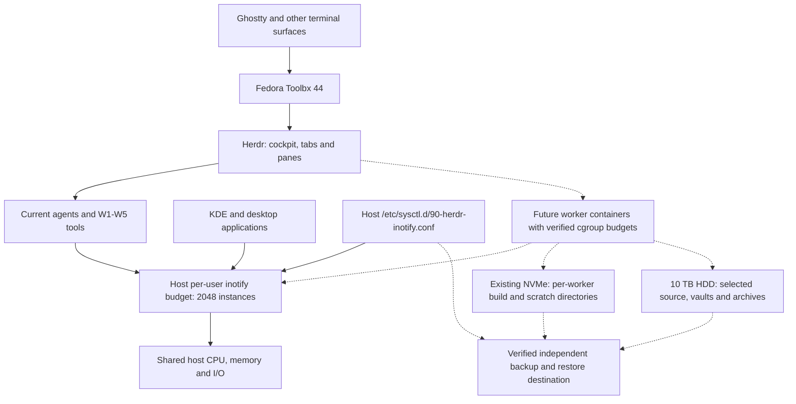
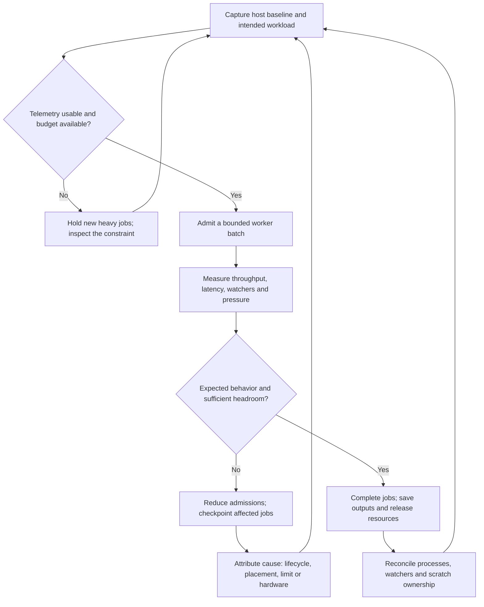

# Linux Inotify Capacity — Herdr Habitat

The KDE **“Inotify Instance Capacity Low”** condition was reproduced and resolved on `orac` on 2026-09-06 (Australia/ACT). The host instance ceiling is now **2,048**, up from **128**, persisted in `/etc/sysctl.d/90-herdr-inotify.conf`. No reboot or service restart was performed.

KDE measured **118 / 128 instances (92%)** before the change and **120 / 2,048 (5% in KDE's integer display; 5.86% calculated)** afterward. The initial watch count was only **594 / 827,880 (0.072%)**. This incident concerned the number of watcher instances, not the number of files being watched.

All investigation artifacts, the exact configuration, reusable audit and verification scripts, and the guarded apply/rollback script are saved in [[40 Reference/inotify/2026-09-06/README|the evidence bundle]]. Related: [[00 - Toolshed Index]] · [[00 - Field Findings]] · [[herdr]] · [[bacon]] · [[podman]].

Future operations: [[#Future management narrative]] · [[#Kinoite management and recovery]] · [[#Management schematics]] · [[#Hardware assessment and recommendations]] · [[#Useful web resources for ongoing management]]. The incident fix is applied; the management model below is guidance for subsequent implementation.

## Verified habitat context

| Layer | Observed state |
|---|---|
| Host | Fedora Kinoite `44.20260831.0`, kernel `7.1.12-200.fc44.x86_64`, hostname `orac` |
| Memory | `/proc/meminfo`: 98,561,264 KiB total, approximately 94 GiB |
| Development environment | Fedora 44 Toolbx; Herdr's processes use user namespace `4026533249` |
| Herdr | Installed version `0.8.2`; two live workspaces, 14 tabs, 35 panes |
| Main workspace | `herdr-habitat`: 13 tabs, 34 panes |
| Main tabs | `Orchistrator`, Zen, Hermes, Fabric, Workspace 1–5, Fleet Alpha/Beta/Gamma/Delta |
| Fleet allocation | Four fleet tabs with three panes each; layout presence is not evidence that every worker is active |
| Other workspace | `~`: one tab, one pane |
| Working directories | Home, the vault-family root, `/var/mnt/STORAGE-10TB/repos`, and the `deep-diff-forge` and `herdr` repositories |
| Warning component | Installed `kde-inotify-survey-26.08.0-1.fc44.x86_64` and KDED module `/modules/inotify` |

The habitat notes describe Ghostty → Toolbx → Herdr, with W1–W5 services and Fleet Alpha–Delta. The supplied screenshot supports that layout context; its displayed pixels did not expose the warning text clearly enough to transcribe. The exact warning title came from the user's report and was matched to KDE's installed notification component and upstream source. The process census also found Konsole windows; terminal brand does not isolate the resource budget.

HEE, AuthRoster, and the proposed morphogenic coding/build/DevOps/SynOps factory remain distinct project contexts. This work changes the host resource prerequisite; it does not activate or certify those projects or their planned factory services.

## Diagnosis and evidence

The installed KDE survey reproduced the reported condition. Its source uses a **90% warning threshold**, samples every **10 minutes**, and exposes a `refresh()` D-Bus method. It closes its active warning when the measured ratio drops below the threshold. See the [version-matched KDE source](https://raw.githubusercontent.com/KDE/kde-inotify-survey/v26.08.0/src/kded/kded.cpp).

A separate read-only `/proc` census agreed with KDE at 118 inotify file-descriptor references across 52 readable processes, with 594 watch references. The largest groups were:

| Process name/group | Inotify FD references |
|---|---:|
| codex, combined | 20 |
| plasmashell | 10 |
| Chrome processes, combined | 10 |
| Konsole processes, combined | 10 |
| ChatGPT processes, combined | 9 |
| krunner | 8 |
| Obsidian processes, combined | 7 |
| codex-code-mode | 6 |
| kded6 | 4 |
| baloo_file | 3 |

Several Toolbx Codex processes each exposed two instances and 39 watches; bacon exposed two instances and 33 watches, and yazi one instance and three watches. The distribution supports an undersized shared ceiling under the current workload. These snapshots do **not** establish whether a particular process leaks resources over hours or days.

**Measurement limits:** KDE and the audit enumerate process FDs, not a deduplicated kernel quota counter. Inherited or duplicated descriptors can overcount, while permissions and process churn can undercount. The first audit recorded 37 inaccessible process FD directories, 177 inaccessible FD operations, and one disappearing FD. Do not interpret `2048 - visible references` as exact guaranteed available capacity. The 92% value is the reproduced KDE warning metric, not a proof of exact kernel occupancy.

The sandbox initially exposed only its own small PID namespace and could not reach the host D-Bus or Herdr socket. This would have produced a misleading zero-consumer result if treated as a host census. Host diagnostics were rerun through authorized `flatpak-spawn --host`; actual Herdr Toolbx verification was also run outside the nested execution sandbox.

## Applied change and sizing decision

| Setting | Before | After | Reason |
|---|---:|---:|---|
| `fs.inotify.max_user_instances` | 128 | **2,048** | 16× capacity to accommodate the measured desktop/development baseline and expanding agent fleets |
| `fs.inotify.max_user_watches` | 827,880 | 827,880 | Measured usage was below 0.1%; no evidence to raise it |
| `fs.inotify.max_queued_events` | 16,384 | 16,384 | No queue-overflow evidence was found in the bounded investigation |

**2,048 is a local operational choice**, not a Linux or Herdr mandated value, a measured optimum, or a prediction of safe worker concurrency. A higher ceiling permits additional allocation when applications create instances; it does not preallocate thousands of watchers. Actual watchers and queued events still consume kernel memory. The Linux [inotify manual](https://www.man7.org/linux/man-pages/man7/inotify.7.html) distinguishes the instance, watch, and per-instance event-queue limits.

The setting applies as a host per-user ceiling, so other host users also receive the higher ceiling. Rootless containers are not independent resource budgets: the [kernel's ucount accounting](https://github.com/torvalds/linux/blob/master/kernel/ucount.c) walks ancestor user namespaces. Here the host's `user.max_inotify_instances` was 128 while the nested environment displayed 2,147,483,647 for that namespace-local key; the host restriction still mattered. Raising Toolbx-only settings, `ulimit -n`, or watch limits would not address the identified host instance ceiling.

The exact installed file is:

```ini
# Herdr habitat on Fedora Kinoite; investigated 2026-09-06 by SOL3.
# KDE reported 118/128 instances (92%); 594/827880 watches.
# Host-wide per-user ceiling. Capacity is allocated only as applications use it.
# Preserve the existing watch and queue limits; tune them only from evidence.
fs.inotify.max_user_instances = 2048
```

Host ownership and permissions are `root:root`, mode `0644`; SELinux type is `system_conf_t`. The guarded script used host administrator authentication, wrote this file atomically, and applied **only this file** using `sysctl -p /etc/sysctl.d/90-herdr-inotify.conf`.

The host's `systemd-sysctl --cat-config` includes the file, with no conflicting later assignment. This establishes that persistence is configured correctly under [systemd's sysctl.d rules](https://www.man7.org/linux/man-pages/man5/sysctl.d.5.html). Boot-time application has not been tested by rebooting; verify readback after the next normal reboot. No immutable `/usr` modification, package layering, or Toolbx rebuild was needed.

## Verification

| Check | Result |
|---|---|
| Host sysctl readback after apply | **2,048**, PASS |
| Host bounded functional test | 160 simultaneous instances, one watched directory, expected file-create event received; all resources released, PASS |
| Nested Toolbx execution sandbox | Same functional test, PASS |
| Actual Herdr Toolbx namespace `4026533249` | Same functional test, PASS |
| Post-test KDE census | 120 instances / 2,048; 633 watches / 827,880 |
| Persistent configuration | Exact payload present in merged boot configuration; root ownership and mode verified |
| KDE status refresh | `org.kde.inotify.refresh` invoked successfully, exit 0 |

The functional test deliberately exceeded the old 128-instance ceiling while staying far below the new one. It did not probe to exhaustion or interrupt existing watchers. The final live Toolbx test provided namespace-specific evidence beyond the initial sandbox test. Existing panes were not restarted or closed. The notification refresh succeeded; pixel-level verification of notification dismissal was not performed.

## Operating runbook for the growing factory

From a Toolbx shell, inspect the same summary KDE uses:

```bash
flatpak-spawn --host kde-inotify-survey | jq '.totals'
```

For consumer attribution without collecting command arguments or terminal transcripts:

```bash
flatpak-spawn --host python3 '/var/mnt/STORAGE-10TB/fedora-obsidian-vaults/toolshed.vault/40 Reference/inotify/2026-09-06/inotify-audit.py'
```

KDE already supplies periodic monitoring, so no additional background watcher or timer was installed. For future factory scheduler integration, use these **proposed local operating thresholds**: review sustained growth at 70%; defer additional watcher-heavy fan-out at 85% until inspected; KDE's existing desktop warning remains at 90%. These are recommendations, not deployed scheduler gates. Treat unreadable or failed telemetry as unknown and retain timestamps and measurement limitations.

Keep worker watching scoped to the repository/worktree needed for its job. When configuring a watcher, exclude generated `target/`, `node_modules/`, `.venv/`, caches, and archive trees where those files are irrelevant to that tool. Do not blanket-disable source/configuration watching. Share reusable watchers where the application's supported architecture allows it, and close them when a worker exits. Capture comparable before/during/after censuses at fleet peaks; repeated growth after workers finish warrants a process-specific leak investigation before another limit increase.

The Toolshed field findings also record HDD journal saturation from Rust build outputs (F111), shared `CARGO_TARGET_DIR` contamination (F116), and `/tmp` quota failures (F118). Those are separate capacity dimensions: use per-worker build/scratch directories on the NVMe, and carry CPU, memory, I/O, disk/quota, process, and open-FD budgets into future fleet admission. An inotify fix alone does not establish whole-factory capacity. No changes to those other settings were made here.

## Future management narrative

As Herdr grows into a coding, build, DevOps and SynOps factory, each additional worker should enter a measured resource budget. A pane is a place to observe work; it is not a CPU allocation, an isolation boundary, or an independent inotify allowance. Begin each operating cycle with a short host census, then record the workload admitted: project/worktree, worker count, build parallelism, scratch location, and expected completion. This makes a later capacity warning explainable instead of an invitation to keep increasing limits.

Use the current machine as the baseline. Over a representative week, collect comparable observations at quiet periods, normal development, peak builds or mutation runs, and after worker teardown. Pair watcher counts with successful job throughput, completion latency, memory availability, pressure metrics and storage latency. The useful question is whether another worker completes more work without degrading the cockpit or existing jobs. A higher configured limit and an empty pane do not answer it.

For a first operating policy, retain the proposed **70% review / 85% admission hold** thresholds for inotify, and investigate sustained pressure before admitting more work. These thresholds are local starting points, not upstream guarantees. Use several samples and a cooldown before resuming so the scheduler does not oscillate. Missing host telemetry should hold new heavy jobs for inspection rather than being interpreted as zero usage. Protect already-running work by stopping new admissions first; any cancellation must follow the job's recorded checkpoint and recovery behavior.

Workers should acquire and release their resources as a lifecycle: create a dedicated worktree and scratch directory, establish the required watchers, run within declared limits, capture outputs, close descriptors, and reconcile remaining processes and artifacts. When a count keeps rising after comparable workers finish, investigate the owning process. An inotify event queue overflow requires the consumer to reconcile its filesystem state; raising the queue limit alone cannot reconstruct lost events. Design future consumers to rescan and recover rather than treating event delivery as a durable transaction log. See [Linux inotify behavior](https://www.man7.org/linux/man-pages/man7/inotify.7.html).

For unattended operation, persist enough information to resume after a stopped process or unavailable provider: job identity, source revision, worktree location, last completed step, artifact locations and a bounded retry history. Keep the control processes responsive when builds are busy. Repeated faults should reduce admissions and surface a durable incident, rather than create an unbounded restart loop. This is a proposed operating model; no scheduler, restart policy or autonomous deployment service was installed by this note update.

| Cadence or trigger | Management action | Evidence to retain |
|---|---|---|
| Start of a working session; before a large fleet expansion | Read host inotify totals, pressure, available memory and destination capacity | Timestamp, namespace/host identity, worker count and intended workload |
| During a representative peak | Compare throughput and response time as concurrency changes one step at a time | Completed jobs, elapsed time, failures, PSI and disk interval counters |
| End of a worker batch | Reconcile watchers, worker processes and worktrees; distinguish retained caches from abandoned scratch | Before/after consumer counts and explicit ownership of retained state |
| Weekly | Review trends, configuration drift and update readiness; check backup freshness | Capacity trend, deployment versions, drift diff and backup receipt |
| Monthly or after a material change | Restore a representative project and configuration into an isolated location; review recovery time | Readable restored files, revision/checksum comparisons and recovery duration |
| After the next planned reboot | Verify the 2,048 limit, storage mounts, Herdr service and one file-event test | Booted deployment, sysctl readback and functional receipt |

## Kinoite management and recovery

Keep ownership explicit: administrator kernel settings belong on the **host** under `/etc`; mutable tools live in Toolbx; user services and rootless container definitions live in the user's persistent configuration; project data and recovery artifacts need their own backup policy. The [rpm-ostree administration handbook](https://coreos.github.io/rpm-ostree/administrator-handbook/) explains staged deployments, layering and filesystem layout. An OS rollback is not a restore of project data in `/var`; inspect configuration on the chosen deployment as well.

There is a concrete maintenance consideration on this host: the read-only 2026-09-06 inspection found a **staged deployment**, while the booted deployment reported `unlocked: transient` and a `live-replaced` checksum. This does not establish a fault, but it means the booted version label alone does not describe all live changes. Before the next planned reboot, review `rpm-ostree status --json`, record what is staged, save active work and capture needed configuration. Recheck behavior afterward. The inotify file is persistent host configuration; it does not depend on retaining a live `/usr` overlay. The filtered observation is archived as `management-kinoite-state.json`.

A maintenance window should drain new jobs, let bounded work finish or checkpoint, verify recovery material, apply the intended update, reboot, and bring back a small representative workload before full concurrency. Keep a known-good deployment available until the new one is verified. Herdr session/layout restoration and a saved agent conversation do not keep the old process alive across reboot. Test actual recovery of one job before treating the unattended fleet as recoverable.

For future worker isolation, the host reports **cgroups v2 with the systemd manager**. [Podman Quadlet](https://docs.podman.io/en/latest/markdown/podman-systemd.unit.5.html) provides declarative rootless container units, normally under `~/.config/containers/systemd/`. Define worker resources there or through the supported Podman options and inspect the generated unit before activation. Verify the actual payload process's cgroup: a limit on the Herdr launcher alone may not constrain a separately created container scope. Controller delegation and ancestor limits must be checked for the intended rootless placement; their presence at the host root is not proof of availability in every child.

| Future control | Intended role | Verification before relying on it |
|---|---|---|
| `CPUWeight` / `CPUQuota` | Prioritize interactive control work; bound sustained CPU use where needed | Observe the worker's real cgroup and throughput under contention |
| `MemoryHigh` / `MemoryMax` | Reclaim/throttle before a hard memory boundary | Read `memory.events`; a hard cap can cause an OOM failure and needs job recovery |
| `TasksMax` | Bound processes and threads created by a worker | Verify legitimate compiler/test parallelism still fits |
| I/O weights or bandwidth controls | Reduce interference between batch work and the cockpit | Confirm controller support and the underlying device mapping; measure latency |
| Host inotify census | Detect the per-user watcher budget across applications | Keep this alongside cgroup controls; worker containers do not each receive a fresh 2,048-instance pool |

The meanings and limits of these controls are documented in [systemd resource control](https://www.man7.org/linux/man-pages/man5/systemd.resource-control.5.html) and the [kernel cgroup v2 reference](https://docs.kernel.org/admin-guide/cgroup-v2.html). Values require workload measurements; the table is not an installed configuration.

Keep build outputs, mutation scratch and temporary working copies on the existing NVMe with separate directories per concurrent worker. Review cleanup ownership before removing anything; blanket pruning during a fleet run can erase material needed for recovery. The 10 TB disk can retain vaults, archives and appropriately scheduled source/data access. The older Kinoite overview still mentions its historical `/run/media/...` mount; current host evidence confirms `/var/mnt/STORAGE-10TB`. Use the live mount as the runbook path.

Back up the host inotify drop-in, user service/Quadlet definitions, project sources and important worktrees, plus durable job state. Exclude only artifacts proven reproducible. A disk beside the workstation is not evidence that a backup exists, is current, or can be restored. [Restic integrity checks](https://restic.readthedocs.io/en/stable/045_working_with_repos.html#checking-integrity-and-consistency) and [isolated restore procedures](https://restic.readthedocs.io/en/stable/050_restore.html) are useful references; schedule data-reading checks away from heavy builds and protect repository credentials separately. Recovery-point and recovery-time targets should be chosen per project.

Further local context: [Kinoite System Maintenance](obsidian://open?vault=fedora-kinoite.vault&file=System%20Maintenance), [Podman Quadlets and Rootless Mastery](obsidian://open?vault=fedora-kinoite.vault&file=Podman%20Quadlets%20and%20Rootless%20Mastery), [habitat Settings Backup and Restore](obsidian://open?vault=herdr-fedora-habitat.vault&file=60%20Fedora%20Synergies%2FSettings%20Backup%20and%20Restore), and [Advanced Deployment Architecture](obsidian://open?vault=herdr-fedora-habitat.vault&file=95%20Genesis%2FSchematic%20-%20Advanced%20Deployment%20Architecture). These are navigation links; commands and historical “verified” claims still need checking against the current installation.

## Management schematics

**Resource ownership and proposed expansion.** Solid connections describe the observed foundation and its shared resources. Dashed connections describe the recommended future worker/storage arrangement, not services deployed by this task.



**Proposed management loop.** Admission decisions use measurements and workload outcomes; resource limits are reviewed changes, not automatic responses to every warning.



These Mermaid schematics render in Obsidian and remain editable with the note. They intentionally do not map panes one-to-one to containers or CPU cores.

## Hardware assessment and recommendations

**No additional hardware is required to resolve the inotify incident.** The limit change already passed functional checks. The follow-up host sample at approximately **06:02 Australia/ACT, 2026-09-06** provides this baseline; it is a five-second observation of an uncontrolled workload, not a capacity benchmark.

| Observed resource | Measurement | What it supports |
|---|---|---|
| CPU | Ryzen 7 7800X3D, 8 cores / 16 logical CPUs; CPU PSI averages displayed 0.00% | No evidence from this sample for a CPU upgrade; peak compilation throughput remains to be measured |
| Memory | About 94 GiB usable, 66 GiB available; memory PSI averages displayed 0.00% | No demonstrated need for more RAM |
| zram swap | 8 GiB configured, about 7.6 GiB occupied | Occupancy alone does not prove current RAM shortage; correlate swap activity, memory pressure and job latency |
| Main NVMe | Samsung 990 PRO with Heatsink 2 TB; about 1.60 TiB available on the home filesystem | Substantial existing fast capacity for worker scratch and build outputs |
| Archive HDD | WD 10 TB, ext4, mounted at `/var/mnt/STORAGE-10TB`; about 6.69 TiB available | Capacity is available; historical build I/O incidents still argue for NVMe placement of generated outputs |
| Other drives | Samsung 850 EVO 1 TB with mounted existing partitions; WD 4 TB USB disk mounted as NTFS | Existing data/ownership and drive health need review before any proposed reuse |

**A pressure signal needs further attribution:** host I/O PSI remained around 74–78% `some avg10` and 73–76% `full avg10`, while this interval showed only about **1.4% busy time on the HDD** and **1.2% on the NVMe**, with no D-state process caught at scan time. The pressure signal and the short device sample do not identify a saturated disk or a failing component. Historical HDD saturation must not be silently substituted as the cause of this new observation. Collect aligned per-cgroup pressure and process/device counters during a representative slow job before choosing a remedy. The [kernel PSI guide](https://docs.kernel.org/accounting/psi.html) explains stall percentages; [I/O counter documentation](https://docs.kernel.org/admin-guide/iostats.html) explains the interval statistics and their limitations.

| Priority | Recommendation | Purchase or implementation trigger |
|---|---|---|
| Now | Use the existing NVMe for properly separated build/scratch directories; measure representative fleet peaks | No hardware purchase indicated; migration and cleanup require a separate concrete implementation task |
| Before relying on unattended work | **If no tested UPS exists, recommend a Linux-compatible UPS** with a supported USB/network monitoring interface and graceful-shutdown integration | Measure actual workstation, storage and required network power draw; choose watt capacity and manufacturer runtime sufficient to checkpoint and shut down with margin |
| Before relying on unattended recovery | **If no independently recoverable copy exists, recommend an independent backup destination**, with an offline or off-site copy | Inventory protected data, retention and restore targets first; the attached 4 TB drive is not assumed empty, healthy, large enough, or already a backup |
| If active storage becomes the measured constraint | Consider a **dedicated 2–4 TB NVMe** for worker scratch/build I/O | Existing free fast storage becomes inadequate, or repeatable latency contention remains after placement/concurrency fixes; check motherboard slots, lane sharing, cooling, endurance and compatibility before selecting a model |
| If CPU or memory limits become the measured constraint | Consider a separate build worker or a targeted CPU/RAM upgrade | Representative jobs repeatedly miss throughput goals while CPU/memory pressure identifies the bottleneck; compare cost and operating complexity after tuning parallelism |
| If local model inference becomes a defined workload | Revisit GPU/VRAM requirements against the actual models and concurrency | No GPU purchase recommendation follows from file-watcher capacity or API-based coding agents |

For a UPS, check the **exact model and interface** against the [Network UPS Tools compatibility list](https://networkupstools.org/stable-hcl.html), then design and test controlled shutdown using [upsmon](https://networkupstools.org/docs/man/upsmon.html). UPS presence, measured power draw, battery runtime and current backup recoverability were not established in this task. Drive SMART/NVMe health, motherboard expansion capacity and thermal behavior were also not tested, so no replacement drive, PSU, RAM kit or specific UPS model is prescribed.

The recommended spending order is therefore conditional: **protect recoverability and power continuity if absent; use existing fast storage; buy more capacity only after a repeatable workload identifies the constraint.** This is operational advice for the proposed factory, not a hardware procurement or deployment action.

## Useful web resources for ongoing management

| Resource | When it is useful |
|---|---|
| [rpm-ostree administration](https://coreos.github.io/rpm-ostree/administrator-handbook/) | Understand booted/staged/live state, planned updates and OS rollback |
| [systemd sysctl.d](https://www.man7.org/linux/man-pages/man5/sysctl.d.5.html) | Audit persistent kernel settings and override precedence |
| [Podman Quadlet reference](https://docs.podman.io/en/latest/markdown/podman-systemd.unit.5.html) | Define future rootless workers and inspect generated service behavior |
| [systemd resource control](https://www.man7.org/linux/man-pages/man5/systemd.resource-control.5.html) | Select CPU, memory, task and I/O controls with understood consequences |
| [Linux cgroup v2](https://docs.kernel.org/admin-guide/cgroup-v2.html) | Verify real hierarchy, delegation, worker membership and counters |
| [Linux PSI](https://docs.kernel.org/accounting/psi.html) · [disk I/O statistics](https://docs.kernel.org/admin-guide/iostats.html) | Distinguish workload stalls from simple utilization or free-capacity numbers |
| [Restic repository checks](https://restic.readthedocs.io/en/stable/045_working_with_repos.html) · [restore](https://restic.readthedocs.io/en/stable/050_restore.html) | Verify backup integrity and practice recovery into a separate destination |
| [NUT hardware compatibility](https://networkupstools.org/stable-hcl.html) · [upsmon](https://networkupstools.org/docs/man/upsmon.html) | Evaluate UPS integration and planned power-loss handling |

These primary references were accessed on 2026-09-06. The Fedora Kinoite website's update/technical-information pages returned an anti-bot page during this investigation; the accessible upstream rpm-ostree handbook and local host evidence support the management guidance instead. Check the installed versions before implementing examples from moving `latest` documentation.

## Reapply, validate, and rollback

Review the archived script before privileged execution. It refuses an unexpected host, a changed managed file, a symlink target, or an unexpected current instance limit. To reapply the same reviewed configuration from Toolbx:

```bash
flatpak-spawn --host pkexec /usr/bin/python3 '/var/mnt/STORAGE-10TB/fedora-obsidian-vaults/toolshed.vault/40 Reference/inotify/2026-09-06/apply-inotify.py'
```

For a bounded functional recheck after planned maintenance:

```bash
flatpak-spawn --host python3 '/var/mnt/STORAGE-10TB/fedora-obsidian-vaults/toolshed.vault/40 Reference/inotify/2026-09-06/verify-inotify.py'
```

Rollback is intentionally **not run** during verification: returning to 128 under this workload would recreate the capacity problem. After reducing workload sufficiently, the following removes only the unchanged managed file and restores the previous runtime value:

```bash
flatpak-spawn --host pkexec /usr/bin/python3 '/var/mnt/STORAGE-10TB/fedora-obsidian-vaults/toolshed.vault/40 Reference/inotify/2026-09-06/apply-inotify.py' --rollback
```

The rollback path has been reviewed but not exercised against the live host. Archive the managed host configuration with future habitat settings backups; this evidence bundle already preserves its exact contents and SHA-256 manifest.

## Sources and cross-vault context

- [Linux inotify(7)](https://www.man7.org/linux/man-pages/man7/inotify.7.html): limits, resource lifetime, queues, and FD information.
- [KDE inotify survey](https://github.com/KDE/kde-inotify-survey) and [installed-version KDED source](https://raw.githubusercontent.com/KDE/kde-inotify-survey/v26.08.0/src/kded/kded.cpp): warning origin, threshold, polling and refresh behavior.
- [systemd sysctl.d(5)](https://www.man7.org/linux/man-pages/man5/sysctl.d.5.html): local drop-ins, precedence and boot application.
- [Linux inotify implementation](https://github.com/torvalds/linux/blob/master/fs/notify/inotify/inotify_user.c) and [ucount implementation](https://github.com/torvalds/linux/blob/master/kernel/ucount.c): namespace accounting; upstream master is supplemental rather than a byte-for-byte proof of Fedora's running kernel.
- [Herdr stable documentation index](https://herdr.dev/llms.txt) and [v0.8.2 troubleshooting](https://raw.githubusercontent.com/herdrdev/herdr/v0.8.2/docs/next/website/src/content/docs/troubleshooting.mdx): version-matched Herdr references. Installed CLI and live snapshot supplied the actual workspace evidence.
- [Habitat Home](obsidian://open?vault=herdr-fedora-habitat.vault&file=Home), [Ghostty → Toolbx → Herdr](obsidian://open?vault=herdr-fedora-habitat.vault&file=60%20Fedora%20Synergies%2FGhostty%20Toolbox%20Herdr%20Stack), and [Multi-Agent Orchestration](obsidian://open?vault=herdr-fedora-habitat.vault&file=40%20Agents%2FMulti-Agent%20Orchestration): navigation and documented topology, verified against live state where used.
- [Kinoite master index](obsidian://open?vault=fedora-kinoite.vault&file=00%20-%20Fedora%20Master%20Index) and [Troubleshooting & Recovery](obsidian://open?vault=fedora-kinoite.vault&file=Troubleshooting%20%26%20Recovery): OS/container and persistence context. Fedora's online technical-information page returned an anti-bot response, so it was not used as evidence for claims about this host.

The durable documentation and evidence additions are in Toolshed, as requested; other vaults were used as read-only context. The applied system setting lives separately in host `/etc`, and the original bootstrap working copy remains under `/var/home/Louranicas/herdr-inotify-20260906`. Sources were accessed on 2026-09-06 Australia/ACT. See [[40 Reference/inotify/2026-09-06/Prime Receipt|Prime Receipt]] for initial bounded vault provenance and [[40 Reference/inotify/2026-09-06/README|README]] for the evidence inventory and subsequent management additions.
