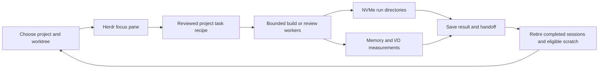

# lukes workflows

Luke's habitat has substantial memory headroom in the measured session: **65.84–66.49 GiB available out of 93.995 GiB usable RAM**. The largest practical improvement is to manage temporary build and journal data deliberately, followed by reviewing heavyweight sessions that remain open between tasks. Buying more RAM is not indicated by these readings.

This assessment combines live Fedora process and filesystem measurements, the current Herdr layout, installed Atuin queries, ten Fedora history backups, and an older Atuin archive covering the Zellij/Herdr lineage. It documents recommendations; no agents were stopped, temporary data deleted, history imported, or runtime configuration changed during this workflow audit.

Navigation: [[00 - Toolshed Index]] · [[10 Tools/atuin|atuin]] · [[10 Tools/just|just]] · [[10 Tools/herdr|herdr]] · [[Most-Used Tools]] · [[50 Field Notes/Linux Inotify Capacity - Herdr Habitat|Inotify capacity and future habitat management]]. Measurements, methods, coverage and scripts: [[40 Reference/lukes-workflows/2026-09-06/README|workflow evidence bundle]].

**Workflow integration — 2026-09-06:** the recommendations now feed the
[[60 Workflows/00 - Workflows#Daily operating cycle — reviewed 2026-09-06|daily operating cycle]],
[[20 Chaining/Workflow Recipes|revised recipes]] and their supporting workflow notes.
[[40 Reference/workflow-review/2026-09-06/README|The review receipt]] records source-confirmed
limits: uncapped ready-stage concurrency, probes/preconditions that still run during dry-run,
and reactor respawn that can undo an intentional service shutdown. Those behaviours were
documented; no runtime scheduler or supervisor changes were made.

## What is using memory now

The main process baseline was captured **6 September 2026 at 06:16 ACT**, with a second memory/cgroup reading at **06:22 ACT**. These are snapshots, not a recording of the largest possible build load. Raw timestamps in the evidence are UTC.

| Measurement | Observed | Meaning for this workflow |
|---|---:|---|
| Available memory | 65.84 → 66.49 GiB | Large immediate headroom; assess this alongside pressure and responsiveness. |
| Completely free memory | About 23 GiB | A smaller number because Linux uses spare memory for caches. |
| `/proc/meminfo` Cached, first sample | 44.95 GiB | Includes tmpfs/shared memory; the entire number is not ordinary disposable disk cache. |
| Shmem, first sample | 10.73 GiB | Includes resident tmpfs and other shared memory; overlaps the cache view. |
| zram original data / physical allocation | 7.51 / 3.30 GiB, first sample | Logical swapped data is compressed in RAM. It is not an additional 7.51 GiB of physical RAM. |
| Memory pressure, `some avg60` | 0.02% → 0.07% | Little measured memory stall time during these samples. |
| Readable `/tmp` allocation | 16.36 GiB | Significant temporary storage in tmpfs, backed by RAM and potentially swap. |
| Main Toolbx cgroup, second sample | 29.52 GiB current | Includes descendants and file cache; it is not Herdr's application memory. |

Linux's available-memory estimate accounts for reclaimable resources; a full-looking RAM bar alone does not establish shortage. PSS apportions shared mapped pages between processes, whereas adding RSS repeatedly counts shared pages. Tmpfs can use swap, and zram reports original, compressed and allocated sizes separately. These views **overlap and must not be added together**. [Linux memory concepts](https://docs.kernel.org/admin-guide/mm/concepts.html), [PSS accounting](https://www.man7.org/linux/man-pages/man5/proc_pid_smaps.5.html), [tmpfs](https://docs.kernel.org/filesystems/tmpfs.html), [zram statistics](https://docs.kernel.org/admin-guide/blockdev/zram.html).

The Toolbx cgroup contained **3.66 GiB anonymous memory and 24.85 GiB file memory**, including **7.55 GiB shmem within that file figure**. A memory limit applied to this shared container would affect multiple tools and their caches. It would be a poor substitute for identifying and budgeting individual workers.

### Process groups worth reviewing

These are readable proportional resident memory totals for processes sharing the recorded Linux process name. Helper processes with other names are separate, and process counts are not window, tab or agent counts.

| Process name/group | Processes | PSS | Practical interpretation |
|---|---:|---:|---|
| `chrome` | 35 | 1.90 GiB | Review unused tabs/windows and background activity. Its summed RSS was 5.54 GiB, illustrating shared-page double counting. |
| `obsidian` | 16 | 1.32 GiB | Keep the vault windows needed for the current work; measure before blaming a particular plugin. |
| `hermes` | 2 | 1.15 GiB | Check whether both processes serve ongoing work before retiring a session. |
| `hermes-tools-mc` | 5 | 0.69 GiB | Together with the Hermes-named processes, about 1.84 GiB warrants an ownership/lifecycle review. Sharing safety has not been established. |
| `codex` | 9 | 1.10 GiB | Review completed sessions and their helpers; this is not nine proven independent agents. |
| `ChatGPT` | 13 | 0.78 GiB | Retain when it provides a distinct active workflow. |
| `claude` | 1 | 0.46 GiB | Its associated scratch tree is much larger than its proportional resident process memory. |
| `mempalace` | 1 | 0.32 GiB | Check service ownership before considering demand-based startup. |
| `konsole` / `ghostty` | 5 / 1 | 0.27 / 0.14 GiB | Terminal choice is a lower-priority saving than retained build outputs. |
| `herdr` server and client | 2 | **59.45 MiB** | The pane arrangement itself is inexpensive. |

Additional small observations: a tmux server used under 1 MiB PSS; no live Zellij process appeared in the named-process census. Thirteen `drkonqi-coredum` processes together used about 0.11 GiB. Review lingering crash-reporting activity when convenient, but it is not the leading capacity issue. Some process mappings were inaccessible, so this table is not a complete host application inventory.

## The largest actionable finding: temporary data

Host `findmnt` confirms **`/tmp` is tmpfs with `usrquota` enabled**. The global filesystem was around 35% occupied. That percentage does not establish a particular user's remaining quota. The bounded `du` could not read twelve service-private directories, so 16.36 GiB is the readable allocation, not a complete ownership audit.

| Location | Allocated size | What was established |
|---|---:|---|
| `/tmp/.tmpwMcd2m`, `/tmp/.tmpD0g5Ez`, `/tmp/.tmpKHO6XS` | **6.13 GiB combined** | Each contains a large `journal/seg-000001-000001.ndjson`; metadata dates precede this audit. No contents were read. |
| `/tmp/claude-1000` | **5.49 GiB total** | A live Claude process held a reference to a task directory within this tree. |
| One session's `scratchpad` within that Claude tree | **5.27 GiB**, included above | Dominated by `cold-out/target`, `wt-verify-target`, `wt-anchor-target`, and `cold-target`. Parent and child figures overlap. |
| Other `/tmp/tmp.*` directories | Many around 174 MiB each | Sizes recorded; ownership, content and retention requirements remain unclassified. |

**First recommendation:** review the three journal directories for provenance and retention, then retire only those proven obsolete. No open reference was found for them in the accessible snapshot, but that does not prove they are disposable: processes can reopen files, mappings may remain, and journals can be required evidence. The open Claude reference makes blanket removal of its scratch tree particularly inappropriate.

The 6.13 GiB of journals plus 5.27 GiB of scratch show the scale of the storage opportunity. They are **not a promise to recover 11.40 GiB of physical RAM**: tmpfs allocations can be swapped, and some data is still needed.

**Prevention recommendation:** assign future build outputs and temporary files to task-specific directories on the existing NVMe. Record the owner, project, worktree, run identifier and retention decision. Preserve useful results in the project or designated evidence location; expire only the run directories whose work is finished.

Cargo's target-directory setting and the process temporary directory solve different problems. Use both where the workload supports them. Rust's standard temporary-directory lookup honours `TMPDIR` on this platform; applications that hard-code `/tmp` or run in a different container namespace need their own check. [Cargo environment variables](https://doc.rust-lang.org/cargo/reference/environment-variables.html), [Rust temporary-directory selection](https://doc.rust-lang.org/std/env/fn.temp_dir.html).

Suggested directory convention, **not created or activated by this audit**:

```text
/var/home/Louranicas/.cache/herdr-runs/
  <project>/<worktree>/<run-id>/
    tmp/       -> task-local TMPDIR
    target/    -> task-local CARGO_TARGET_DIR
    receipt    -> owner, command identity, completion and retention status
```

`/var/home` resolves to the existing encrypted NVMe-backed Btrfs filesystem, with about **1.60 TiB available** at inspection. Reuse compatible caches within a deliberately owned worktree when appropriate; concurrent independent worktrees should not casually share one writable target tree. Set these paths in the chosen task runner before launching a new worker, and verify them from inside that worker. Avoid a global shell change that silently redirects unrelated sessions.

This recommendation is consistent with earlier Toolshed field findings about disk-heavy builds, shared target contamination and `/tmp` quotas (F111, F116, F118 in [[00 - Field Findings]]). Those historical incidents provide context; they do not prove the provenance of today's journal files.

F118 already documents a mutation runner that owns its NVMe `TMPDIR` and deliberately **unsets inherited `CARGO_TARGET_DIR`** so disposable copies use isolated targets. Preserve that runner's isolation contract. Confirm the current project recipe implements it, then use that recipe instead of wrapping every tool in one global target-directory override.

The subsequent workflow review checked `repos/herdr-engineering-engine-v2/scripts/mutants.py`
directly: it sets `TMPDIR` to `~/.cache/hee-mutants-tmp`, removes inherited `CARGO_TARGET_DIR`
and requests six mutation jobs. Thus an additional outer fleet can multiply that concurrency;
the earlier two-worker/two-Cargo-job idea must not be assumed to cap this runner's mutation jobs.
Its scratch comment still mentions tmpfs, but the executable assignment points to home cache.

## What Atuin reveals, and what it cannot tell us

Installed **Atuin 18.12.1** was actually queried. Its local help and a metadata-only search are saved with the evidence. SQLite sources were opened read-only; the older compressed database was streamed into memory and queried as a checkpoint without importing it into the active history.

| Source | Coverage | Result |
|---|---|---|
| Active Fedora database | 1–5 September 2026 UTC; 80 recorded sessions | **287 records**, one recorded `toolbx:Louranicas` host identity. |
| Ten Fedora history backups on STORAGE-10TB | Separate dated snapshots | Their record IDs add **zero** records beyond the active database. Do not add backup totals as additional activity. |
| Older `atuin.tar.zst`, archived under `tier2-substrates/atuin/latest` | 10 January–30 August 2026 UTC; 1,661 recorded sessions | **127,613 records**, historical `ORAC7` host identities; Zellij, Herdr and worktree activity represented. |
| Other accessible habitat locations | STORAGE-10TB migration tree and the current `mint-nvme15t` directory | Bounded file discovery; no legacy executable was launched. |
| SATA/USB historical partitions | Present but unmounted during this audit | Not mounted or inspected internally. This is not an exhaustive claim about every physical drive. |

The two historical lineages are reported separately; they were not cross-deduplicated into one lifetime total. Older daily archives were not all decompressed, and the archive checkpoint is not a guarantee of complete historical activity.

In the active database, **105 of 287 records begin with `cd`**, 26 with `codex`, 23 with `mempalace`, nine with `claude`, and eight with `herdr`. **198 records fall on 2 September**, so this is heavily influenced by setup and experimentation. It supports making project entry easier; it does not establish that Luke personally spent 37% of his work navigating directories.

The older checkpoint contains **38,137 leading `cd` records, 3,320 `cargo`, 707 `herdr`, 447 `zellij`, and seven `tmux`**. It also contains **11,541 records mentioning `CARGO_TARGET_DIR`** in the inspected command prefixes, compared with 67 mentioning `TMPDIR`. This suggests build-output placement has received more explicit recorded attention than general temporary-file placement. It is an inference: wrappers, configuration and truncated commands can hide both settings.

Historical paths cluster around `claude-code-workspace`, `loom-lattice-habitat`, `heb`, and multiple worktrees. They describe earlier environments; they are not adopted as today's canonical paths or project instructions.

History does **not** measure RAM, prove which human or agent issued a command, or capture every GUI action and agent tool call. A recorded `cd` has a 77,509-second duration, demonstrating why shell-history elapsed time is unreliable as a productivity metric here. Exit `-1` means unknown/unfinished; exit 137 alone does not prove an out-of-memory kill. Classification is conservative, and the archive analysis examines at most the first 4,096 characters of each command.

### Use recall to reduce repeated setup

Make the current project the starting context in each working pane. Promote a repeatedly useful, reviewed operation into a project-owned [[10 Tools/just|just]] recipe, then recall that recipe instead of repeatedly reconstructing paths and flags. Preserve a clear division between a runbook's maintained command and a historical example that merely happened to run once.

This metadata-only query was verified against the installed build:

```bash
atuin search --filter-mode global --search-mode full-text \
  --include-duplicates --limit 5 \
  --format '{time} | {host} | {directory} | {exit} | {duration}' herdr
```

Here `global` searches the current database across its recorded contexts; it does not search every archive on every drive. The installed spelling is **`full-text`**, despite `fulltext` appearing in an older vault example. For ordinary use, narrow recall to the relevant project or directory and inspect the command before choosing to execute it. Do not pipe historical search results into a shell. [Atuin search reference](https://docs.atuin.sh/main/reference/search/), [Atuin advanced usage](https://docs.atuin.sh/main/guide/advanced-usage/).

## Recommended working rhythm

Keep Herdr's useful spatial arrangement. The live snapshot has **two workspaces, 14 tabs and 35 panes**, with six Codex-detected panes and one each for Claude, Hermes and Pi. Several panes are idle/done and others are plain shells. The layout is not evidence that 35 heavyweight workers are running. A label such as “unassigned” can lag the detected process state; use actual process ownership and task status when deciding what to retire.

| Priority | Change to trial | Benefit and check |
|---|---|---|
| 1 | Give new build/test workers explicit NVMe scratch and output paths | Prevent repeated multi-GiB tmpfs growth. Compare `/tmp`, run-directory growth and task duration. |
| 2 | Review ownership and retention of old journals and completed scratch | Largest measured storage opportunity. Preserve necessary evidence and live work before any deletion. |
| 3 | Checkpoint completed heavyweight agent sessions; start helpers when needed | Hermes-named processes/helpers total about 1.84 GiB; other agents also accumulate. Measure actual savings rather than assuming every helper is private. |
| 4 | Review unused browser and Obsidian windows | Their named groups total about 3.21 GiB PSS; only a portion may be removable. Check active tasks and unsaved edits first. |
| 5 | Start panes in their project's working directory and use maintained task recipes | Reduces repeated setup and accidental context changes suggested by both Atuin samples. |
| 6 | Profile complete build/review cycles before expanding parallelism | Peak build memory was not measured. Record wall time, memory pressure, I/O and output growth together. |

**At the start of a session**, choose one primary project, its working tree and its active executor. Keep the orchestrator and useful review panes, but launch specialist workers when a concrete task needs them. Unoccupied Fleet Beta/Gamma/Delta shells can stay as navigation structure without prewarming every agent and tool server.

**During focused work**, use one edit/build feedback loop. When independent review or builds can help, expand deliberately. On the observed 8-core/16-thread Ryzen 7 7800X3D, a reasonable *initial experiment* is two build workers with two Cargo jobs each, then compare against one worker. This is a trial setting, not a measured optimum; test processes, linkers, language servers and mutation runners may create additional concurrency beyond Cargo's job count. [Cargo job settings](https://doc.rust-lang.org/cargo/reference/environment-variables.html).

**At handoff**, record what completed, what is still running, where outputs live, and which temporary directories are eligible for later retirement. A detached or hidden terminal does not by itself end its processes. Closing a completed session should be an intentional lifecycle action with a recoverable handoff.

**At the end of the day**, keep the panes that make tomorrow's work easy, save the important state, and retire completed heavyweight sessions through their normal exit path. Review temporary storage by owner and completed run, not by a broad wildcard over `/tmp`.

For Chrome, consider Memory Saver for inactive tabs, with exceptions for pages supporting ongoing interactive work. Measure its effect on the next comparable session. No browser preferences or personal tab contents were inspected or changed. [Chrome performance settings](https://support.google.com/chrome/answer/12929150?hl=en).



## Kinoite management and the future factory

Keep host resource policy, development-tool environments, and project data separately owned. The live system places persistent home data under `/var/home`; the existing [[50 Field Notes/Linux Inotify Capacity - Herdr Habitat#Kinoite management and recovery|Kinoite management note]] records the host/Toolbx boundary, deployment state and recovery considerations. Changes to development recipes can be trialled within a project without layering more packages onto the host.

For a larger factory, each independently managed worker should eventually have a named owner, a bounded queue, a lifecycle, a storage allowance and measurable resource use. Apply resource controls at the actual worker/container boundary after measuring a representative job. `MemoryHigh` can impose reclaim pressure and `MemoryMax` is a hard boundary with possible workload termination; neither should be copied blindly onto the shared Herdr Toolbx. [systemd resource controls](https://www.man7.org/linux/man-pages/man5/systemd.resource-control.5.html), [cgroup v2 memory accounting](https://docs.kernel.org/admin-guide/cgroup-v2.html).

A proposed operational trigger is to investigate when available memory stays below **20 GiB** or memory `some avg60` exceeds **1% for several minutes** during comparable work. These are initial habitat review thresholds, not kernel limits or settings applied here. Record whether the desktop and builds actually slow down. Adjust the thresholds after representative peak-load measurements.

For the first week, compare the same representative build/review operation before and after one change at a time. Success means the same correctness checks pass, no temporary-storage quota errors occur, peak pressure stays acceptable, and completion time or desktop responsiveness improves. Do not claim an optimisation from a lower idle RAM bar alone.

Use `free -h`, `/proc/pressure/{memory,io}`, `vmstat`, proportional process memory, and per-worker accounting together. A saved starting and finishing snapshot is useful; a peak sampler during a real build is better. Avoid routinely dropping caches or turning swap off to improve a display: it can discard useful cache or force memory back into RAM without solving the workload's cause. [Linux memory concepts](https://docs.kernel.org/admin-guide/mm/concepts.html), [pressure-stall information](https://docs.kernel.org/accounting/psi.html).

### An unresolved performance signal: I/O pressure

Memory pressure was low, but I/O `some avg10` was around **70–78%** in the two main samples. Later `vmstat` intervals showed about 18% I/O wait. A separate three-second device sample found only about 0.81% NVMe busy time and no blocked threads in the visible `/proc` scan. These short, differently timed observations do not explain the pressure signal or prove an HDD bottleneck.

Before purchasing storage or increasing build concurrency to solve perceived slowness, capture pressure deltas, visible blocked tasks, per-worker I/O and per-device latency over the **same representative slow operation**. Namespace/visibility and timing need to be checked if the metrics disagree. This is the principal unresolved performance question from the audit.

### Hardware recommendation

**Use the current hardware first.** Around 66 GiB was available, and the existing Samsung 990 PRO NVMe had about 1.60 TiB free. That supports a scratch-placement trial without a RAM or SSD purchase. It does not establish that an unrestricted future fleet will fit.

Revisit RAM only if representative peak runs show sustained low availability and memory stalls after workflow improvements. Consider a separate build host when measured CPU, storage contention or fault isolation limits the desktop's useful concurrency. Choose capacity from measured jobs and desired parallelism. The earlier [[50 Field Notes/Linux Inotify Capacity - Herdr Habitat#Hardware assessment and recommendations|hardware and resilience assessment]] also covers conditional backup and UPS considerations.

## Evidence handling and scope

Archive commands and old habitat prose were treated as data, never as instruction authority. No historical shell commands were replayed; no old agent memory, identity, configuration, credentials or executables were installed, sourced or imported. The archive's history database was processed in memory; only newly authored analysis scripts, aggregate counts, filesystem/process metadata and documentation were saved to Toolshed.

No raw history database or command transcript is in the evidence bundle. The available history and short live samples support the recommendations above, with explicit coverage gaps. They do not establish an exact peak resource requirement, prove a memory leak, or authorize indiscriminate cleanup.
